# 🐱🍌 XBot — The Ultimate AI-Powered Web3 Telegram Bot

<p align="center">
  
</p>

    

**[🇬🇧 English](#-english) | [🇨🇳 简体中文](#-简体中文) | [🇻🇳 Tiếng Việt](#-tiếng-việt) | [🇰🇷 한국어](#-한국어) | [🇷🇺 Русский](#-русский) | [🇮🇩 Bahasa Indonesia](#-bahasa-indonesia)**

---

<br>

<details open>
<summary><h2>🇬🇧 English</h2></summary>

> 🤖 **Live Demo**: Try XBot now at [@XlayerAi_bot](https://t.me/XlayerAi_bot). To enable AI, use `/api` → "Google API" → "Add API" ([get key here](https://aistudio.google.com/api-keys)). XBot is open-source — deploy your own instance on your VPS!

---

### 📑 Table of Contents
- [Features](#-features-at-a-glance)
- [Screenshots](#️-showcase--capabilities)
- [Architecture](#-project-architecture)
- [Complete Self-Hosting Guide](#-complete-self-hosting-guide)
- [Web Dashboard](#-web-dashboard)
- [Command Reference](#-command-reference)
- [AI Capabilities](#-advanced-ai-capabilities)
- [Security](#️-security-protocols)
- [Roadmap](#️-project-roadmap)
- [Contributing](#-contributing)

### 🚀 What's New in v1.2.9 (Smart Copy-Trader Revamp & Treasury Deprecation)
- **Treasury Feature Deprecation**: Successfully removed the experimental 'Treasury & Pet' feature from the entire ecosystem (UI routing, sidebars, internal APIs) to streamline the Web Dashboard experience.
- **Smart Copy-Trader UI Overhaul**: Completely modernized the Smart Copy-Trader interface using scalable Tailwind CSS and beautiful glassmorphism gradients. Eliminated rigid inline styles, integrated dynamic budget bars, and upgraded the UI to feature an elegant top-traders leaderboard.
- **Universal Localized i18n Integration**: Fully decoupled hardcoded strings from the Smart Copy-Trader module. Injected the deep `smartCopyPage` namespace across all 6 core language dictionaries (English, Vietnamese, Chinese, Korean, Russian, Indonesian), ensuring native translation parity for every interactive element.
- **OnchainOS API Backend Alignment**: Refactored the core background `discoverLeaders` algorithm in `smartCopyEngine.js`. Aligned the parser to dynamically digest comma-separated address payloads (`triggerWalletAddress`) and accurately cross-reference decoupled API traits (`buyTxCount`, `sellTxCount`, `realizedPnlUsd`), fixing systemic leader scoring errors.
- **Critical Process Stabilization**: Patched an unclosed syntax block inside `dashboardRoutes.js` that was inducing continuous backend PM2 crash loops, significantly boosting system uptime.

<details>
<summary>📜 Click to view previous Release Notes (v1.2.0 - v1.2.8)</summary>

### 🚀 What's New in v1.2.8 (Modal Portal Architecture & Leaderboard i18n Fix)
- **React Portal Modal Architecture**: Migrated all full-screen modal overlays (`GroupDetailModal`, `UserGroupDetailModal`, `BroadcastModal`) from inline rendering to `ReactDOM.createPortal(modal, document.body)`. This eliminates a critical CSS containing-block bug where `position: fixed` backdrops were visually clipped by parent elements with active CSS animations (`fadeIn`, `pageEnter`), leaving an uncovered white strip above the modal overlay covering the Header and Sidebar.
- **CSS Animation Containing-Block Fix**: Stripped `transform` properties from `@keyframes fadeIn` and `@keyframes pageEnter` in `index.css`. Per CSS spec, any element with an active animation involving `transform` creates a new containing block, which causes `position: fixed` descendants to be positioned relative to that element instead of the viewport. Animations now use `opacity`-only transitions to avoid this browser behavior.
- **Checkin Leaderboard i18n Completion**: Injected missing translation keys (`streak`, `monthly`, `allTime`) into the `checkinPage` block across all 6 language dictionaries (`en`, `vi`, `zh`, `ko`, `ru`, `id`). Previously, the leaderboard tabs rendered raw i18n key paths (e.g., `dashboard.checkinPage.streak`) instead of localized labels.

### 🚀 What's New in v1.2.7 (Group Admin Dashboard & Deep i18n Parity)
- **Dynamic Scope Resolution (Topic/User)**: Re-architected the Group Language Tab to dynamically expose numeric input fields for `Topic ID` and `User ID`. The Web Dashboard now cleanly communicates with Telegram's strict thread mechanics by passing direct integer identifiers down to the backend `db.setTopicLanguage` and `db.setUserLanguage` engines.
- **Deep Component i18n Auditing**: Methodically unhardcoded over 20 embedded English strings scattered across `WelcomeTab.jsx` (Difficulty sliders, Sync status), `ModerationTab.jsx` (Action confirmations, placeholders), and `CheckinTab.jsx` (Leaderboard modes). Every textual artifact is now routed safely through the `useTranslation` hook.
- **Universal 6-Language Parity Enforcement**: Eliminated a critical translation bleed-over where English keys forcibly overwrote the `groupDetail` taxonomy block across all localized files. Restored strict phonetic accuracy for Vietnamese, Chinese, Korean, Russian, and Indonesian translation matrices.
- **UI/UX Modal Standardization**: Stripped out legacy sticky footers and enforced cohesive `rounded-2xl` glassmorphism styling across all internal Group Management pop-ups (`Welcome`, `Checkin`, `Moderation`, `Price Alerts`).

### 🚀 What's New in v1.2.6 (Mobile CSS Architecture Refactoring & Responsive UX)
- **CSS Grid Architecture Overhaul**: Rectified a critical flex-layout anomaly causing excessive, uncontrolled vertical stretching on dynamic glass-cards across the web dashboard by enforcing strict `items-start` parameters across all grid containers. 
- **Restricted Modifier Scoping**: Identified and neutralized a cascading CSS leakage where a ubiquitous `.fixed.inset-0` modal wrapper rule was inadvertently forcing a brutal `min-h-screen` parameter across the entire app footprint. The fix strictly confines the max-height override uniquely to standard backdrop-blurred overlays.
- **Adaptive Chat Widget Geometry**: Completely restructured the floating AI Chat widget's CSS geometry. Instead of breaking viewport boundaries with fixed rigid dimensions on small phones, the overlay now seamlessly morphs into a fluid, safe-area padded fullscreen view specifically calibrated for mobile viewports.
- **Micro-Padding Compaction**: Implemented an aggressive mobile rhythm overhaul across the entire DashboardPage—substantially tightening component paddings (`p-5` to `p-3`), optimizing icon scalar containers, reducing visual gaps (`space-y-6` to `space-y-4`), and enforcing side-by-side metric stacking (`grid-cols-2`) for critical real-time portfolio data.

### 🚀 What's New in v1.2.5 (Advanced Wallet Management & Analytics Export)
- **Dynamic Limits Enforcement**: Unshackled wallet import and creation parameters from restrictive hardcoded bounds, implementing a fluid max-cap system completely synchronized with owner-defined user limits.
- **Enterprise Excel Compatibility**: Integrated essential UTF-8 BOM byte-order marking into the client-side file blobs, outright ending character scrambling (mojibake) when visualizing multi-lingual names in commercial data viewers.
- **Parametric Export Pipeline**: Expanded the flat CSV downloads into a comprehensive 5-column metric footprint (`Private Key`, `Wallet Name`, `Address`, `Balance ($)`, `Export Time/Creation Time`), dynamically polling live unified Portfolio values and device-native localized timestrings.
- **Intelligent Filename Taxonomy**: Rewrote the export modules to programmatically inject deep contextual markers into filenames: connected `uid`/`username` tags, specifically bound network locators (e.g., `XLayer_196`), aggregate batch density counts, and granular sequence timestamps.

### 🚀 What's New in v1.2.4 (Professional Error Handling & Persistence)
- **AI Settings Persistence**: AI preferences (Model, Provider, Persona, Thinking) are now seamlessly synchronized with `localStorage`, guaranteeing your session settings survive page reloads and browser restarts without reverting to server defaults.
- **Localized Personal Assistant Error Protocol**: Deprecated raw, hardcoded API technical error messages. XBot now intercepts API/Auth faults and serves them through a dynamic, 6-language `i18n` localization matrix using a warm, personal assistant tone. 
- **Frictionless Error Resolution**: Introduced intuitive, direct-action "⚙️ AI Settings" shortcuts embedded within API error notifications, allowing users a one-click path to instantly rotate expired or invalid API keys.
- **Refined Welcome Broadcast Links**: Synchronized the global `/start` command payload across all 6 core languages, updating the ecosystem creator handle and cementing the definitive Xbot Official X presence.

### 🚀 What's New in v1.2.3 (AI Chat Mobile UX Optimization)
- **Responsive Navigation Upgrade**: Resolved AI Chat Page usability bottlenecks by replacing cramped components with large (44px) touch-friendly action targets, including a dedicated "Conversations" toggle with an integrated unread counter.
- **Dynamic Header Resizing**: Alleviated severe mobile overflow clipping by restructuring the core header toolbar to conditionally hide non-essential desktop modules (e.g. Compare, Export), securely wrapping long AI persona strings.
- **Deep Component Localization**: Truncated 20+ persistent hardcoded English strings across deep UI components (ToolCallCards, ActionSheets, PasteDetectionBanners) by mapping them securely to the `i18n` dictionary.
- **Universal Multi-Language Parity**: Extended translation block parity (`chatPage`) into all 6 core system languages (EN, VI, ZH, KO, RU, ID), guaranteeing immediate runtime localization for international users.

### 🚀 What's New in v1.2.2 (Advanced User Management)
- **Direct Messaging Engine**: Owners can now seamlessly broadcast HTML-formatted direct messages to individual users, selected groups, or the entire userbase directly from the Web Dashboard.
- **Granular AI API Rate Limiting**: Introduced a dynamic per-user AI request quota system. Owners can easily throttle limits (0 to Unlimited) via new bulk-action modals or intuitive inline dropdowns to protect server API keys.
- **Enhanced Dashboard UI**: Upgraded the `Users` page with a completely redesigned floating bulk-action bar, real-time AI usage statistical cards, and expanded multi-language translations explicitly supporting EN, VI, ZH, KO, RU, and ID.

### 🚀 What's New in v1.2.1 (Ecosystem Auto-Discovery)
- **Zero-Touch Community Listing**: Verified and documented the automated bot-integration pipeline. Telegram groups are instantly indexed and displayed on the Web Dashboard the moment `@XlayerAi_bot` is added as an administrator.
- **Multilingual Onboarding UX**: Expanded the dashboard call-to-actions with detailed, 6-language (EN, VI, ZH, KO, RU, ID) typography instructing users on the automated bot-integration process.
- **Real-Time Synergy**: Confirmed the dashboard's dynamic fetch-loops (member counts, avatars, and live integration statuses) operate synchronously with background Telegram Webhook events.

### 🚀 What's New in v1.2.0 (XLayer Ecosystem Hub)
- **Live Token Intelligence**: Integrated OKX OnchainOS directly into the Web Dashboard to stream real-time prices, 24h volatility, and external explorer links for established XLayer ecosystem tokens.
- **Secure Community Proxy**: Implemented a backend proxy router to securely relay Telegram Group Avatars (Logos) using the Bot Token, completely shielding sensitive credentials from public client-side.
- **Dynamic Member Sync**: The dashboard now automatically pulls live member counts and group invite links for registered Telegram Supergroups via the bot's background polling service.
- **Multi-Language UI Expansion**: The entire Public Live Space, including all ecosystem metrics, CTA banners, and terminology, is now fully localized across 6 languages (EN, VI, ZH, KO, RU, ID).
- **UX Form & Function Polish**: Dropped CSS rendering bugs (maskImage blur), replaced blocked creator handles (`@haivcon_X`), and implemented one-click token address copying for supreme user experience.

---

</details>

### 🌟 Features at a Glance

| Feature | Description |
| :--- | :--- |
| 🔗 **X Layer Optimized** | Supports all OKX OnchainOS chains, deeply optimized for **X Layer**. |
| 🌍 **Dynamic Multi-Language** | Auto-detects and replies in user's language — no hardcoded templates. |
| 🤖 **Multi-Model AI** | Powered by **Google Gemini**, **OpenAI**, and **Groq** for advanced NLP. |
| ⚙️ **Hybrid Operation** | AI natural language + slash command fallback. |
| 🛡️ **Honeypot Protection** | Scans tokens before swaps to block rug-pulls and scams. |
| 🏦 **DeFi & OnchainOS** | Cross-chain DEX swaps, real-time data, multi-wallet management. |
| 📈 **AI Trading Agent** | Autonomous signal-based trading with VWAP/DCA, triple-barrier risk engine, paper mode, and Telegram alerts. |

### 🖼️ Showcase & Capabilities

<details>
<summary>Click to expand 12 demo screenshots</summary>

1. **Instant Token Swap**

*Swap tokens from one or multiple wallets simultaneously with detailed transaction reports.*

2. **Lightning-Fast Transfers**
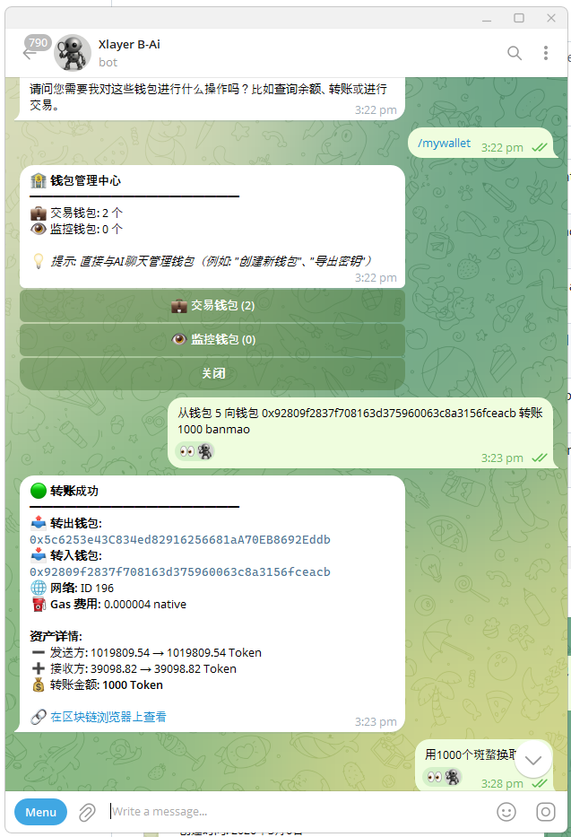
*Transfer funds from one wallet to many, or many to one, in a flash.*

3. **Multi-Wallet Asset Tracking**
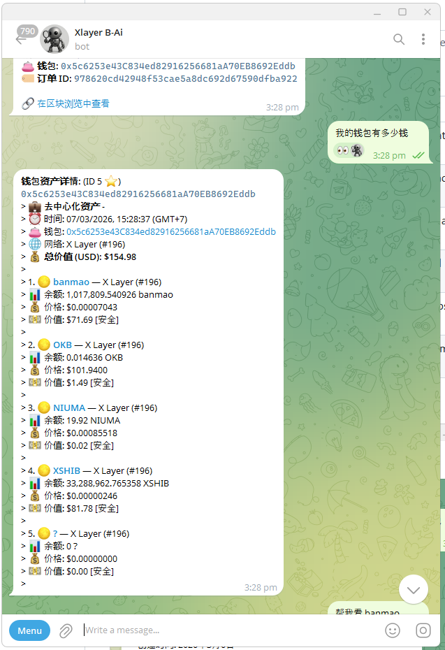
*Check assets of individual or multiple wallets with a simple command.*

4. **Interactive Mini-Games**
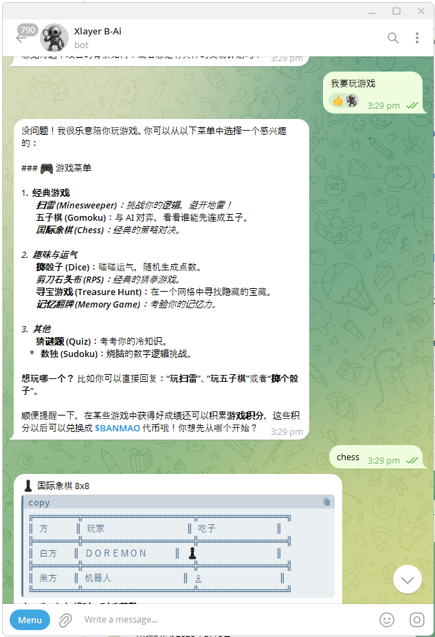
*Play games with XBot or challenge friends in your group.*

5. **Visual Control Panel (`/help`)**
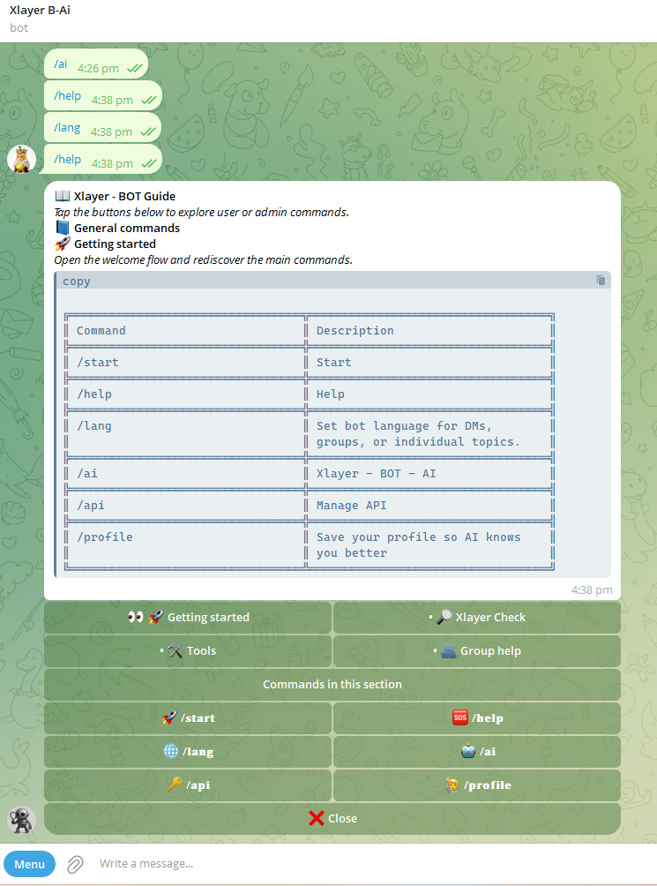
*Interactive menu with buttons for API keys, wallet export, and manual functions.*

6. **Instant Wallet Creation**
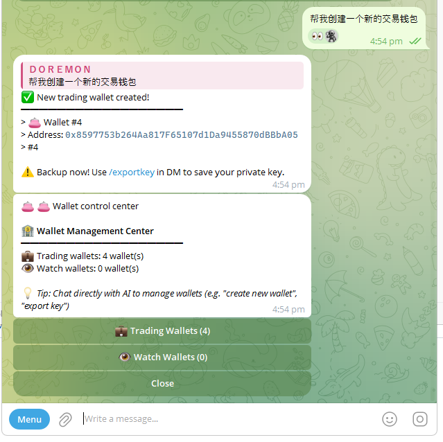
*Create a Web3 wallet in seconds with a simple command.*

7. **On-Chain Smart Money Signals**
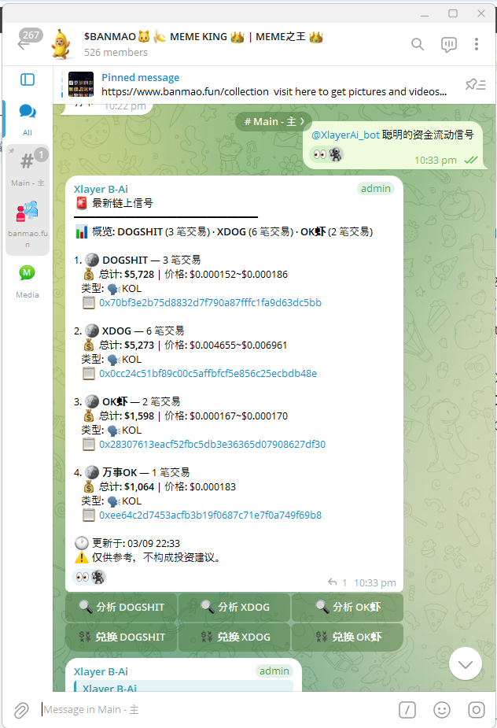
*Real-time buy signals from Smart Money, Whales, and KOL wallets with one-click actions.*

8. **Web Dashboard — User Panel**
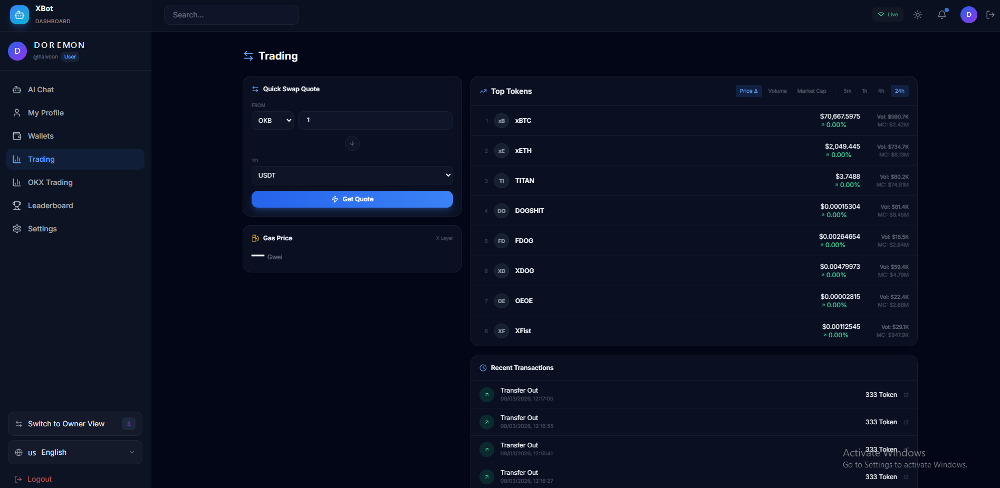
*Swap quotes, gas monitor, token rankings, and transaction history in the browser.*

9. **Web Dashboard — Admin Panel**
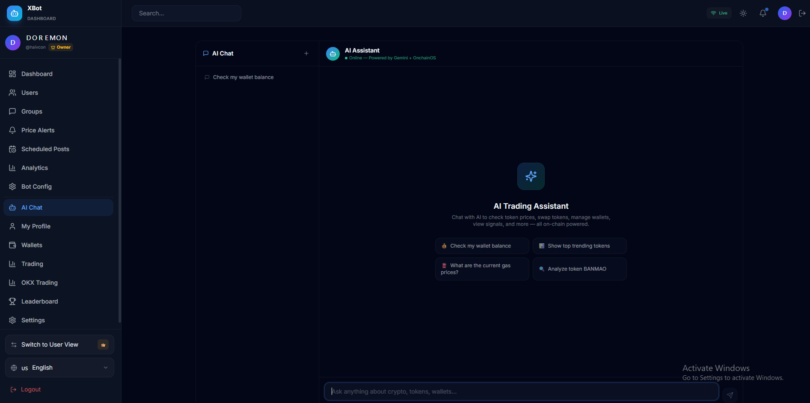
*Complete admin sidebar with AI Trading Assistant chat interface.*

10. **Batch Swap & Export**
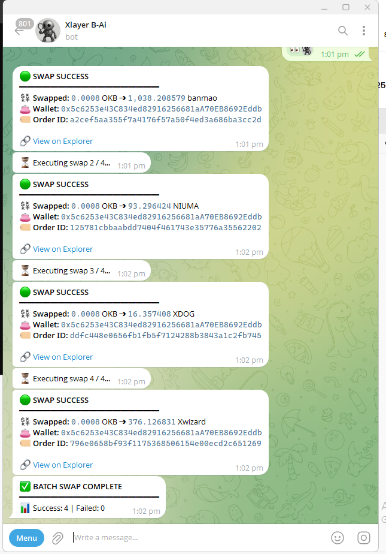
*Multi-token batch swaps with real-time progress and exportable results.*

11. **Anti-Bot Verification**
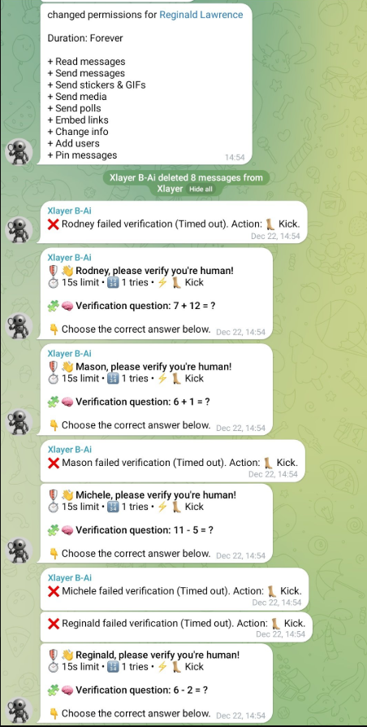
*Math-based verification for new members to prevent spam bots.*

12. **Scheduled Price Reporting**
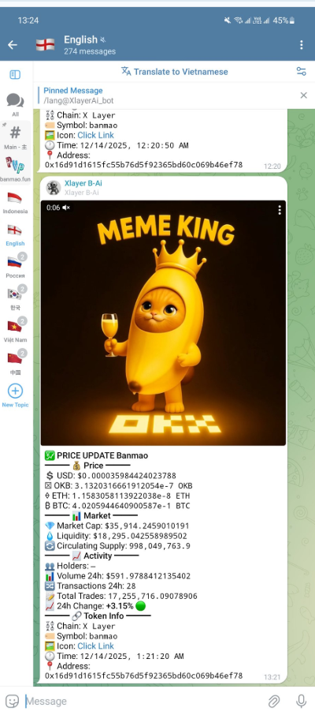
*Automated localized price cards pushed to groups/topics on schedule.*

</details>

---

### 🏗️ Project Architecture

```
xbot/
├── index.js                    # Entry point
├── .env.example                # Environment template
├── package.json
├── DASHBOARD_SETUP.md          # Dashboard deployment guide
│
├── src/                        # Backend source code
│   ├── app/                    # App initialization
│   │   ├── aiHandlers/         # AI message processing
│   │   ├── moderation/         # Group moderation tools
│   │   ├── telegram/           # Telegram bot setup
│   │   └── utils/              # App utilities
│   ├── bot/handlers/           # Bot event handlers
│   ├── callbacks/              # Telegram callback queries
│   ├── channels/               # Multi-channel adapter (Telegram, Discord, etc.)
│   ├── commands/               # Slash commands (/swap, /mywallet, etc.)
│   │   ├── admin/              # Owner-only commands
│   │   └── tools/              # Utility commands
│   ├── config/                 # Configuration & environment
│   ├── core/                   # Core engine (AI router, queue, DB)
│   ├── features/               # Feature modules
│   │   ├── ai/                 # AI chat, persona, streaming
│   │   ├── auth/               # Authentication & JWT
│   │   ├── checkin/            # Daily attendance system
│   │   ├── help/               # Help menu builder
│   │   ├── top-tokens/         # Token ranking system
│   │   └── welcome/            # Anti-bot verification
│   ├── handlers/               # Message & callback handlers
│   ├── plugins/                # Community plugins (marketplace)
│   ├── server/                 # Express API server + Dashboard
│   ├── services/ai/            # AI provider integrations
│   ├── skills/                 # 🔌 Plug-and-play skill modules
│   │   ├── onchain/            # 37 DeFi/blockchain tools
│   │   ├── scheduler/          # 5 background task tools
│   │   ├── memory/             # 3 user memory tools
│   │   └── security/           # 2 anti-scam tools
│   └── utils/                  # Shared utilities
│       ├── format/             # Message formatters
│       └── web3/               # Web3/ethers helpers
│
├── dashboard/                  # React 19 + Vite 6 Web Dashboard
│   └── src/
│       ├── api/                # API client
│       ├── components/         # Reusable UI components
│       ├── hooks/              # Custom React hooks
│       ├── i18n/               # 6-language translations
│       ├── pages/              # Page components
│       │   ├── owner/          # Admin pages (7)
│       │   └── user/           # User pages (8)
│       ├── stores/             # State management
│       └── utils/              # Frontend utilities
│
├── docs/assets/                # Screenshots & media
└── tests/                      # Test suite
```

#### 🔧 Skill Engine Architecture
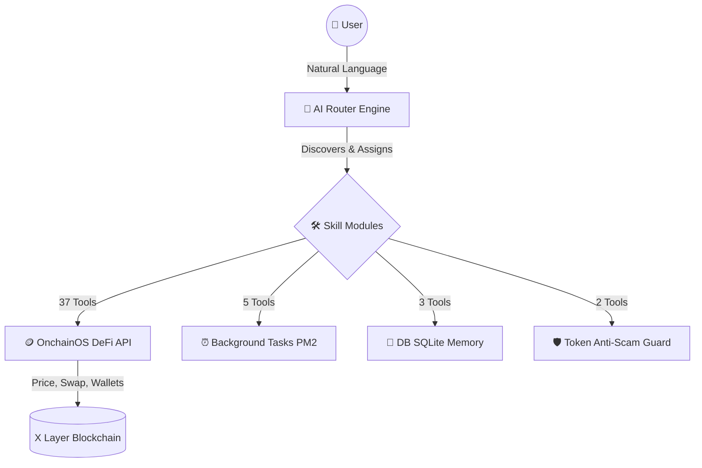

#### 📊 Tech Stack
| Component | Technology |
|-----------|------------|
| Runtime | Node.js 18+ |
| Telegram | node-telegram-bot-api |
| AI | Gemini (primary), Groq, OpenAI |
| Blockchain | OKX OnchainOS API, ethers.js |
| Database | SQLite3 |
| Queue | BullMQ (Redis) / In-memory fallback |
| Dashboard | React 19, Vite 6, TailwindCSS |
| Process Manager | PM2 |

---

### 🚀 Complete Self-Hosting Guide

This guide takes you from **zero to a fully running XBot** on your own server with a custom domain — step by step.

#### 📋 Prerequisites
- A computer with internet access
- A Telegram account
- A credit/debit card (for VPS & domain, ~$5-10/month total)

---

#### Step 1: Create Your Telegram Bot 🤖

1. Open Telegram and search for **[@BotFather](https://t.me/BotFather)**
2. Send `/newbot`
3. Enter a **display name** (e.g., "My XBot")
4. Enter a **username** ending in `bot` (e.g., `my_xbot_bot`)
5. **Copy the HTTP API Token** — you'll need it later:
   ```
   123456789:ABCDefGHIjklMNOpqrsTUVwxyz
   ```
6. (Optional) Send `/setdescription` to set a bot description
7. (Optional) Send `/setuserpic` to upload a bot avatar
8. Get your **Telegram User ID**: message [@userinfobot](https://t.me/userinfobot) and copy the `Id` number

---

#### Step 2: Get Your API Keys 🔑

**A) OKX OnchainOS API** (Required for DeFi features)
1. Go to [OKX Developer Portal](https://web3.okx.com/onchainos/dev-portal)
2. Sign up / Log in
3. Create a new project
4. Copy your **API Key**, **Secret Key**, and **Passphrase**

**B) Google Gemini API** (Required for AI)
1. Go to [Google AI Studio](https://aistudio.google.com/apikey)
2. Click "Create API Key"
3. Copy the key

**C) OpenAI API** (Optional, for GPT models)
1. Go to [OpenAI Platform](https://platform.openai.com/api-keys)
2. Create a new secret key

---

#### Step 3: Fork & Clone from GitHub 📦

**On your computer (Windows/Mac/Linux):**

1. Install [Node.js 18+](https://nodejs.org/) and [Git](https://git-scm.com/)
2. **Fork** this repository on GitHub (click the Fork button)
3. Clone your fork:
   ```bash
   git clone https://github.com/YOUR_USERNAME/xbot.git
   cd xbot
   npm install
   ```

---

#### Step 4: Configure Environment (.env) ⚙️

```bash
cp .env.example .env
```

Edit `.env` with your keys:
```env
# === Required ===
TELEGRAM_TOKEN=your_telegram_bot_token_from_step_1
BOT_OWNER_ID=your_telegram_user_id
GEMINI_API_KEY=your_gemini_api_key
WALLET_ENCRYPT_SECRET=generate_a_random_32_char_string_here

# === OKX OnchainOS (Required for DeFi) ===
OKX_API_KEY=your_okx_api_key
OKX_SECRET_KEY=your_okx_secret_key
OKX_API_PASSPHRASE=your_okx_passphrase

# === Optional ===
OPENAI_API_KEY=your_openai_key
GROQ_API_KEY=your_groq_key
```

> 💡 **Tip**: Generate a random 32-char secret: `node -e "console.log(require('crypto').randomBytes(16).toString('hex'))"`

---

#### Step 5: Test Locally 🧪

```bash
node index.js
```
If you see `✅ Bot started successfully`, message your bot on Telegram — it should respond!

Press `Ctrl+C` to stop when done testing.

---

#### Step 6: Deploy to Ubuntu VPS 🖥️

**A) Buy a VPS**

Recommended providers (cheapest plans $4-6/month):
| Provider | Min Plan | Link |
|----------|----------|------|
| Vultr | $6/mo, 1 vCPU, 1GB RAM | [vultr.com](https://vultr.com) |
| DigitalOcean | $4/mo, 1 vCPU, 512MB RAM | [digitalocean.com](https://digitalocean.com) |
| Hetzner | €3.79/mo, 2 vCPU, 2GB RAM | [hetzner.com](https://hetzner.com) |
| Contabo | €4.99/mo, 4 vCPU, 8GB RAM | [contabo.com](https://contabo.com) |

Choose **Ubuntu 22.04 LTS** as the operating system.

**B) Connect to your VPS via SSH**

```bash
# On Windows: use PowerShell or install PuTTY
# On Mac/Linux: use Terminal
ssh root@YOUR_VPS_IP_ADDRESS
```

Enter the password provided by your VPS provider.

**C) Install required software**

```bash
# Update system packages
sudo apt update && sudo apt upgrade -y

# Install Node.js 18 (via NodeSource)
curl -fsSL https://deb.nodesource.com/setup_18.x | sudo -E bash -
sudo apt install -y nodejs

# Verify installation
node --version   # Should show v18.x.x
npm --version    # Should show 9.x.x or 10.x.x

# Install Git
sudo apt install -y git

# Install PM2 (process manager for 24/7 operation)
sudo npm install -g pm2

# Install build tools (needed for some npm packages)
sudo apt install -y build-essential
```

**D) Clone your repo and configure**

```bash
# Clone your forked repository
cd ~
git clone https://github.com/YOUR_USERNAME/xbot.git
cd xbot
npm install

# Create .env file
cp .env.example .env
nano .env
# Paste your keys from Step 4, then save: Ctrl+X → Y → Enter
```

**E) Install Dashboard dependencies**

```bash
cd dashboard
npm install
npm run build
cd ..
```

**F) Start the bot with PM2**

```bash
# Start bot (serves both bot + dashboard)
pm2 start index.js --name xbot

# Check it's running
pm2 status

# View live logs
pm2 logs xbot

# Make PM2 auto-start on system reboot
pm2 startup
pm2 save
```

**G) Configure firewall**

```bash
# Allow SSH + HTTP + HTTPS
sudo ufw allow 22
sudo ufw allow 80
sudo ufw allow 443
sudo ufw enable
```

> ✅ Your bot is now running 24/7! Test it by sending a message on Telegram.

---

#### Step 7: Custom Domain + SSL (Optional) 🌐

**A) Buy a domain**

Recommended registrars:
- [Namecheap](https://namecheap.com) (~$8-12/year for .com)
- [Cloudflare Registrar](https://www.cloudflare.com/products/registrar/) (at-cost pricing)
- [Google Domains](https://domains.google/) (~$12/year)
- [GoDaddy](https://godaddy.com)

**B) Point DNS to your VPS**

In your domain registrar's DNS settings, add:
```
Type: A
Name: @  (or your subdomain)
Value: YOUR_VPS_IP_ADDRESS
TTL: Auto
```

Wait 5-30 minutes for DNS propagation.

**C) Install Nginx reverse proxy**

```bash
sudo apt install -y nginx

# Create Nginx config
sudo nano /etc/nginx/sites-available/xbot
```

Paste this configuration:
```nginx
server {
    listen 80;
    server_name yourdomain.com;

    location / {
        proxy_pass http://127.0.0.1:3000;
        proxy_http_version 1.1;
        proxy_set_header Upgrade $http_upgrade;
        proxy_set_header Connection 'upgrade';
        proxy_set_header Host $host;
        proxy_set_header X-Real-IP $remote_addr;
        proxy_set_header X-Forwarded-For $proxy_add_x_forwarded_for;
        proxy_set_header X-Forwarded-Proto $scheme;
        proxy_cache_bypass $http_upgrade;
    }
}
```

Enable the config:
```bash
sudo ln -s /etc/nginx/sites-available/xbot /etc/nginx/sites-enabled/
sudo rm /etc/nginx/sites-enabled/default   # Remove default
sudo nginx -t                               # Test config
sudo systemctl restart nginx
```

**D) Install SSL certificate (HTTPS)**

```bash
# Install Certbot
sudo apt install -y certbot python3-certbot-nginx

# Get SSL certificate (replace with your domain)
sudo certbot --nginx -d yourdomain.com

# Auto-renewal is configured automatically
# Test renewal:
sudo certbot renew --dry-run
```

> ✅ Your dashboard is now accessible at `https://yourdomain.com`!

**E) Configure Telegram Login Widget (optional)**

```bash
# In BotFather:
/setdomain
# Select your bot
# Enter: yourdomain.com

# Add to your .env:
DASHBOARD_URL=https://yourdomain.com
```

---

#### Step 8: Deploy Dashboard 🎨

The dashboard builds automatically when you run `npm run build` in the `dashboard/` folder. After deploying:

```bash
# Build dashboard
cd ~/xbot/dashboard
npm run build

# Restart bot to serve new dashboard
cd ..
pm2 restart xbot
```

Access methods:
| Method | URL |
|--------|-----|
| Local | `http://localhost:3000` |
| VPS (no domain) | `http://YOUR_VPS_IP:3000` |
| Custom domain | `https://yourdomain.com` |
| Telegram | Send `/dashboard` to get auto-login link |

---

### 🌐 Web Dashboard

Built with **React 19 + Vite 6**, featuring glassmorphism design, dark/light mode, and 6-language support.

#### 👑 Owner Pages (7 pages)
| Page | Features |
|---|---|
| 📊 **Dashboard** | Real-time health, uptime, memory, event loop, DB status, queue stats |
| 👥 **Users** | User list, search, ban/unban, activity tracking |
| 💬 **Groups** | Telegram group management |
| 📈 **Analytics** | Usage charts, command stats, trend data |
| 🔔 **Alerts** | CRUD price alert management across chains |
| 📅 **Posts** | Scheduled broadcast management |
| ⚙️ **Config** | Runtime config, API key management (masked) |

#### 👤 User Pages (9 pages)
| Page | Features |
|---|---|
| 🤖 **AI Chat** | Browser-based AI chat with real-time streaming |
| 👤 **Profile** | Telegram profile & interaction stats |
| 👛 **Wallets** | Create/manage wallets, token balances, explorer links |
| 📊 **Trading** | Swap quotes, gas tracker, token rankings, tx history |
| 💹 **OKX Trading** | Advanced OKX DeFi tools |
| 📈 **AI Trader** | Autonomous trading agent with paper mode, signal dashboard, positions, VWAP/DCA execution, CSV export |
| 🏆 **Leaderboard** | Game rankings |
| 🌐 **Social Hub** | Communities, feed, DMs, creator leaderboard, profiles |
| ⚙️ **Settings** | User preferences |

#### 🎨 Customization
- **Branding**: `VITE_*` env vars in `dashboard/.env`
- **Languages**: Edit `dashboard/src/i18n/index.js`
- **Theme**: Customize `dashboard/tailwind.config.js` and `dashboard/src/index.css`
- **Pages**: Add in `dashboard/src/pages/`, register in `dashboard/src/App.jsx`

---

### 🎮 Command Reference

#### 🤖 AI Chat
* `/ai <message>` - Chat with AI (Gemini default)
* `/aib <message>` - Chat with custom behavior rules
* `/ai provider` - Switch AI provider

#### 💰 Wallet & DeFi
* `/mywallet` - Wallet manager
* `/swap <from> <to> <amount>` - Quick swap
* `/contract <address>` - Token lookup
* `/toptoken` - Trending tokens

#### 🔍 On-Chain Analysis
* `/meme` - Trending meme tokens | `/meme <addr>` - Meme analysis + dev audit
* `/pnl` - Portfolio PnL | `/dexhistory` - DEX history
* `/tx <hash>` - Transaction detail | `/txhistory` - TX history
* `/trending` - Top gainers | `/topvolume` - Top volume | `/topmcap` - Top mcap

#### 👑 Admin Commands
* `/admin` - Community management panel
* `/checkinadmin` - Daily attendance config
* `/welcomeadmin` - New member verification
* `/price` - Scheduled price alerts

#### 🎲 Games
* `/sudoku`, `/mines`, `/memory`, `/rps`, `/dice`

---

### 🧠 Advanced AI Capabilities
The AI understands complex multi-step operations. Just talk naturally!

<details>
<summary>Click to expand all AI command examples</summary>

#### 💰 Price & Search
* **"What is the current price of ETH?"** — *Real-time pricing*
* **"Search for BANMAO token"** — *Auto-search contract*
* **"Top trending tokens today?"** — *Token rankings*

#### 📊 Technical Analysis
* **"Analyze OKB candlestick chart"** — *RSI, EMA, trend analysis*
* **"Show SHIB top holders"** — *Whale tracking*

#### 🔄 Trading & Swap
* **"Swap 0.1 ETH for USDT"** — *Safe swap with honeypot check*
* **"Batch swap 5 OKB from all wallets to USDT"** — *Multi-wallet batch*

#### 👛 Wallet Management
* **"Create a new wallet"** — *Auto-generate + secure PK delivery*
* **"Check my wallet balance"** — *Full asset scan*
* **"Transfer 2 OKB to 0x123..."** — *Quick transfer*

#### 🛡️ Security
* **"Is this token safe? 0x1234..."** — *Honeypot & risk scan*

#### ⏰ Scheduled Tasks
* **"Watch ETH price every 15 minutes"** — *Auto-monitor*
* **"Alert me if BTC drops 5%"** — *Price alerts*

#### 🧠 Memory
* **"Remember I prefer trading on Solana"** — *Persistent preferences*

</details>

---

### ⚠️ Security Protocols
- **Never share your `.env` file** — it contains API keys and secrets.
- **Private keys** are AES-256-CBC encrypted at rest in the database.
- Use `/exportkey` and `/importkey` only in **DM** (direct message).
- AI **refuses** to execute on detected honeypot tokens.
- Transaction simulation verifies safety before broadcasting.
- Per-user rate limiting prevents API abuse (20 calls/minute).

### 📝 PM2 Quick Reference
```bash
pm2 start index.js --name xbot    # Start bot
pm2 restart xbot                   # Restart
pm2 stop xbot                      # Stop
pm2 logs xbot                      # Live logs
pm2 flush                          # Clear logs
pm2 update                         # Update PM2
```

### 🔄 Updating Your Bot
```bash
cd ~/xbot
git pull origin main              # Pull latest code
npm install                        # Install new deps
cd dashboard && npm run build     # Rebuild dashboard
cd .. && pm2 restart xbot         # Restart
```

---

### 🛣️ Project Roadmap
- [x] X Layer network native optimization
- [x] Multi-AI engine support (Gemini, Groq, OpenAI)
- [x] Open-source framework release
- [x] Professional Web Dashboard
- [x] Meme Token Scanner + developer audit
- [x] Portfolio PnL tracking
- [x] DEX transaction history analytics
- [x] Advanced Token Audit (honeypot, LP burn, sniper detection)
- [x] Smart Trade Activity filtering (KOL, Whale, Smart Money)
- [x] Transaction History Explorer
- [x] Token Ranking & Discovery tools
- [x] Auto Trading Agent — Signal-based automated buy/sell
- [x] AI Trading: Balance pre-check, on-chain sell, concurrent mutex, receipt verification
- [x] AI Trading: Telegram notifications, MemeRadar integration, gas estimation
- [x] AI Trading: Chain ID mapping, retry broadcast, paper trading mode
- [x] AI Trading: CSV trade history export, DCA/VWAP smart routing, Wallet Guardian
- [x] AI Trading: Triple-barrier position engine (stop-loss, take-profit, trailing stop, time limit)
- [x] AI Trading: Technical signals (Bollinger Bands, MACD+BB, SuperTrend)
- [x] Copy Trading System — Follow top traders
- [x] Multi-Step Trading Wizard
- [x] Cross-Chain Arbitrage Scanner
- [x] Plugin Marketplace
- [x] Multi-Channel Architecture (Telegram, Discord, Slack, WhatsApp, Signal, LINE, MS Teams)
- [x] Smart AI Chat — Context-aware, DeFi image analysis, sparkline charts
- [x] Deep Research Pipeline — Multi-source AI synthesis
- [ ] Auto-sniper & automated on-chain signal broadcasts

### 🤝 Contributing
We welcome all Pull Requests! XBot is modular — build your tool inside `src/skills/` and open a PR.

### 💖 Sponsor & Support
If XBot helped your project, please consider supporting development!
**Donate (EVM / XLayer / BSC / ETH):**
`0x92809f2837f708163d375960063c8a3156fceacb`

</details>

---

<br>

<details>
<summary><h2>🇨🇳 简体中文</h2></summary>

> 🤖 **在线体验**: 立即体验 [@XlayerAi_bot](https://t.me/XlayerAi_bot)。启用 AI 请使用 `/api` → "Google API" → "Add API"（[获取密钥](https://aistudio.google.com/api-keys)）。XBot 完全开源 — 你可以在自己的服务器上部署专属实例！

---

### 📑 目录
- [核心功能](#-核心亮点概览)
- [功能截图](#️-核心功能展示)
- [项目架构](#️-项目架构)
- [完整自托管指南](#-完整自托管部署指南)
- [Web 仪表盘](#-web-管理仪表盘)
- [指令参考](#-指令参考)
- [AI 能力](#-强大的-ai-自然语言对话能力)
- [安全机制](#️-安全协议与防范须知)
- [路线图](#️-项目发展蓝图)

---

### 🌟 核心亮点概览

| 功能特性 | 详情描述 |
| :--- | :--- |
| 🔗 **X Layer 专属优化** | 完美支持所有 OKX OnchainOS 链，针对 **X Layer** 进行深度优化。 |
| 🌍 **动态多语言交互** | 自动识别语境，流畅回复用户母语，无硬编码模板。 |
| 🤖 **多维 AI 大模型** | **Google Gemini**、**OpenAI** 和 **Groq** 强力驱动。 |
| ⚙️ **混合双引擎运行** | AI 自然语言全自动 + 斜杠指令手动降级。 |
| 🛡️ **貔貅盘深度防御** | 交易前动态扫描代币合约，拦截貔貅盘、杀手税和极端滑点。 |
| 🏦 **DeFi 与数字资产** | 跨链 DEX 闪兑、实时行情、多钱包聚合管理。 |
| 📈 **AI 自动交易代理** | 信号驱动自动交易，VWAP/DCA智能执行、三重屏障风控、模拟交易、Telegram通知。 |

<details>
<summary>🖼️ 点击展开 12 张功能截图</summary>

1. **瞬间代币闪兑** 
2. **极速自动转账** 
3. **多钱包资产查询** 
4. **互动解压小游戏** 
5. **可视化控制面板** 
6. **秒级钱包创建** 
7. **链上聪明钱信号** 
8. **Web 用户交易面板** 
9. **Web 管理员控制台** 
10. **批量闪兑与导出** 
11. **防机器人验证** 
12. **定时价格播报** 

</details>

---

### 🏗️ 项目架构

```
xbot/
├── index.js                    # 入口文件
├── .env.example                # 环境变量模板
├── src/                        # 后端源码
│   ├── app/                    # 应用初始化（AI处理、频道、工具）
│   ├── commands/               # 斜杠指令（/swap、/mywallet 等）
│   ├── config/                 # 配置与环境变量
│   ├── core/                   # 核心引擎（AI路由、队列、数据库）
│   ├── features/               # 功能模块（AI、签到、验证等）
│   ├── plugins/                # 社区插件
│   ├── server/                 # Express API 服务器
│   ├── services/ai/            # AI 提供商集成
│   ├── skills/                 # 🔌 即插即用技能模块
│   │   ├── onchain/            # 37 个 DeFi 工具
│   │   ├── scheduler/          # 5 个后台任务工具
│   │   ├── memory/             # 3 个记忆工具
│   │   └── security/           # 2 个安全工具
│   └── utils/                  # 共享工具库
├── dashboard/                  # React 19 + Vite 6 Web 仪表盘
│   └── src/
│       ├── pages/owner/        # 管理员页面 (7)
│       ├── pages/user/         # 用户页面 (8)
│       └── i18n/               # 6 语言翻译
└── tests/                      # 测试
```

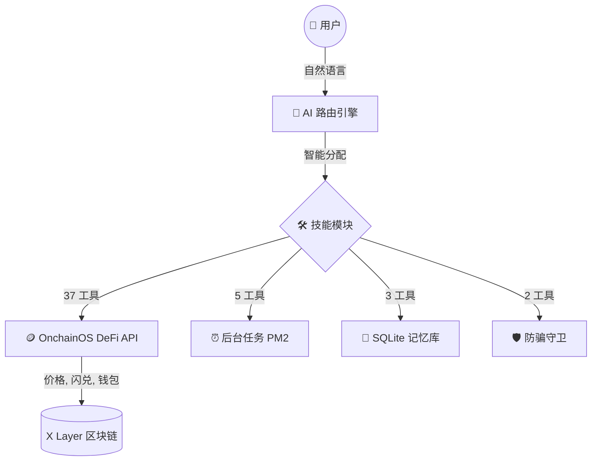

---

### 🚀 完整自托管部署指南

从零开始，一步步将 XBot 部署到您自己的服务器上。

#### 第 1 步：创建 Telegram Bot 🤖
1. 在 Telegram 中搜索 **[@BotFather](https://t.me/BotFather)**
2. 发送 `/newbot` → 设置名称 → 设置用户名（以 `bot` 结尾）
3. **复制 HTTP API Token**
4. 向 [@userinfobot](https://t.me/userinfobot) 发送消息获取您的 **User ID**

#### 第 2 步：获取 API 密钥 🔑
- **OKX**: [开发者平台](https://web3.okx.com/onchainos/dev-portal) → 创建项目 → 获取 API Key / Secret / Passphrase
- **Gemini**: [Google AI Studio](https://aistudio.google.com/apikey) → 创建 API Key
- **OpenAI** (可选): [platform.openai.com](https://platform.openai.com/api-keys)

#### 第 3 步：Fork & 克隆代码 📦
```bash
# 在 GitHub 上 Fork 本仓库，然后：
git clone https://github.com/你的用户名/xbot.git
cd xbot && npm install
```

#### 第 4 步：配置 .env ⚙️
```bash
cp .env.example .env
# 打开 .env 文件，填入您的密钥
```

#### 第 5 步：本地测试 🧪
```bash
node index.js   # 看到 ✅ 即成功，在 Telegram 测试
```

#### 第 6 步：部署到 Ubuntu VPS 🖥️

**购买 VPS**（推荐 Ubuntu 22.04 LTS）：Vultr ($6/月) | DigitalOcean ($4/月) | Hetzner (€3.79/月) | Contabo (€4.99/月)

```bash
# SSH 连接服务器
ssh root@你的VPS_IP地址

# 安装 Node.js 18
curl -fsSL https://deb.nodesource.com/setup_18.x | sudo -E bash -
sudo apt install -y nodejs git build-essential
sudo npm install -g pm2

# 克隆并部署
cd ~ && git clone https://github.com/你的用户名/xbot.git
cd xbot && npm install
cp .env.example .env && nano .env    # 填入密钥

# 编译 Dashboard
cd dashboard && npm install && npm run build && cd ..

# 启动 (24/7)
pm2 start index.js --name xbot
pm2 startup && pm2 save

# 防火墙
sudo ufw allow 22 && sudo ufw allow 80 && sudo ufw allow 443 && sudo ufw enable
```

#### 第 7 步：自定义域名 + SSL 🌐

```bash
# 1. 购买域名：Namecheap / Cloudflare / GoDaddy
# 2. DNS A 记录指向 VPS IP
# 3. 安装 Nginx
sudo apt install -y nginx
sudo nano /etc/nginx/sites-available/xbot
# 粘贴反向代理配置（见英文版详细内容）
sudo ln -s /etc/nginx/sites-available/xbot /etc/nginx/sites-enabled/
sudo rm /etc/nginx/sites-enabled/default
sudo nginx -t && sudo systemctl restart nginx

# 4. SSL 证书
sudo apt install -y certbot python3-certbot-nginx
sudo certbot --nginx -d 你的域名.com
```

#### 第 8 步：更新代码 🔄
```bash
cd ~/xbot && git pull origin main
npm install
cd dashboard && npm run build
cd .. && pm2 restart xbot
```

---

### 🌐 Web 管理仪表盘

#### 👑 管理员页面（7 页）
| 页面 | 功能 |
|---|---|
| 📊 **总览** | 健康状态、内存、延迟、队列 |
| 👥 **用户** | 搜索、封禁、活动跟踪 |
| 💬 **群组** | Telegram 群组管理 |
| 📈 **分析** | 统计图表、指令趋势 |
| 🔔 **警报** | 跨链价格警报 CRUD |
| 📅 **推送** | 定时广播管理 |
| ⚙️ **配置** | API 密钥管理（脱敏） |

#### 👤 用户页面（9 页）
| 页面 | 功能 |
|---|---|
| 🤖 **AI 对话** | 浏览器 AI 实时聊天 |
| 👤 **个人资料** | Telegram 信息与统计 |
| 👛 **钱包** | 创建/管理钱包，余额查看 |
| 📊 **交易** | 报价、Gas、排行榜、历史 |
| 💹 **OKX 交易** | 高级 DeFi 工具 |
| 📈 **AI 交易代理** | 自动交易、模拟模式、信号面板、持仓管理、VWAP/DCA执行、CSV导出 |
| 🏆 **排行榜** | 游戏排名 |
| 🌐 **社交中心** | 社区、动态、私信、排行 |
| ⚙️ **设置** | 偏好设置 |

---

### 🎮 指令参考
* `/ai <内容>` - AI 对话 | `/swap <输入> <输出> <数量>` - 闪兑
* `/mywallet` - 钱包管理 | `/contract <地址>` - 代币查询
* `/meme` - Meme 扫描 | `/pnl` - 盈亏报告 | `/toptoken` - 热门代币
* `/admin` - 管理中心 | `/checkinadmin` - 签到配置
* `/sudoku` `/mines` `/memory` `/rps` `/dice` - 互动游戏

### 🧠 AI 自然语言能力
<details>
<summary>点击展开 AI 指令示例</summary>

* **"ETH 当前价格？"** | **"搜索 BANMAO 代币"** | **"今天热门代币？"**
* **"分析 OKB K线图"** | **"SHIB 持币大户"**
* **"用 0.1 ETH 兑换 USDT"** | **"从所有钱包批量换 5 OKB 到 USDT"**
* **"创建新钱包"** | **"我钱包余额"** | **"转 2 OKB 到 0x123..."**
* **"这个代币安全吗？0x1234..."** | **"每15分钟监控 ETH 价格"**
* **"记住我喜欢在 Solana 交易"**

</details>

### ⚠️ 安全协议
- **绝对不分享 `.env` 文件** | 私钥 AES-256-CBC 加密存储
- 只在 **DM** 中使用 `/exportkey` | AI 拒绝执行貔貅盘交易
- 交易前本地模拟验证安全性 | 每用户速率限制 (20次/分钟)

### 🛣️ 路线图
- [x] X Layer 深度集成 | [x] 多 AI 模型 | [x] Web 仪表盘
- [x] Meme 扫描器 | [x] PnL 追踪 | [x] DEX 历史分析
- [x] 代币审计 | [x] Smart Money 过滤 | [x] 交易浏览器
- [x] 自动交易代理 | [x] 跟单系统 | [x] 交易向导
- [x] 跨链套利 | [x] 插件市场 | [x] 多渠道架构
- [x] 智能 AI 对话 | [x] 深度研究管道
- [ ] Auto-sniper 与链上信号自动播报

### 🤝 参与贡献
欢迎 PR！在 `src/skills/` 中开发您的插件即可。

### 💖 赞助支持
**捐赠地址 (EVM / XLayer / BSC / ETH):** `0x92809f2837f708163d375960063c8a3156fceacb`

</details>

---

<br>

<details>
<summary><h2>🇻🇳 Tiếng Việt</h2></summary>

> 🤖 **Dùng thử ngay**: Trải nghiệm tại [@XlayerAi_bot](https://t.me/XlayerAi_bot). Bật AI: `/api` → "Google API" → "Add API" ([lấy key miễn phí](https://aistudio.google.com/api-keys)). XBot mã nguồn mở — triển khai bản riêng trên VPS của bạn!

---

### 📑 Mục Lục
- [Tính năng](#-tính-năng-nổi-bật)
- [Ảnh chụp màn hình](#️-chức-năng-nổi-bật-qua-ảnh-minh-họa)
- [Kiến trúc dự án](#️-kiến-trúc-dự-án)
- [Hướng dẫn tự triển khai từ A-Z](#-hướng-dẫn-tự-triển-khai-từ-a-z)
- [Bảng điều khiển Web](#-bảng-điều-khiển-web)
- [Danh sách lệnh](#-danh-sách-lệnh)
- [Sức mạnh AI](#-sức-mạnh-trí-tuệ-nhân-tạo)
- [Bảo mật](#️-bảo-mật)
- [Lộ trình](#️-lộ-trình-phát-triển)

---

### 🌟 Tính Năng Nổi Bật

| Tính Năng | Mô Tả |
| :--- | :--- |
| 🔗 **Tối ưu X Layer** | Hỗ trợ mọi chain OKX OnchainOS, siêu tối ưu cho **X Layer**. |
| 🌍 **Đa ngôn ngữ động** | Tự nhận diện và phản hồi bằng ngôn ngữ người dùng. |
| 🤖 **Đa mô hình AI** | Tích hợp **Gemini**, **OpenAI** và **Groq**. |
| ⚙️ **Động cơ kép** | AI tự hành + fallback sang slash command. |
| 🛡️ **Chống Honeypot** | Quét contract token trước mỗi swap để chặn lừa đảo. |
| 🏦 **DeFi xuyên chuỗi** | Swap DEX, giá real-time, quản lý đa ví. |
| 📈 **AI Trading Agent** | Giao dịch tự động theo tín hiệu, VWAP/DCA, rào chắn ba lớp, chế độ giả lập, thông báo Telegram. |

<details>
<summary>🖼️ Bấm xem 12 ảnh minh hoạ</summary>

1. **Swap Token Tức Thì** 
2. **Chuyển Tiền Siêu Tốc** 
3. **Kiểm Tra Tài Sản Đa Ví** 
4. **Trò Chơi Giải Trí** 
5. **Bảng Điều Khiển `/help`** 
6. **Tạo Ví Chớp Nhoáng** 
7. **Tín Hiệu Smart Money** 
8. **Dashboard Người Dùng** 
9. **Dashboard Quản Trị** 
10. **Swap Hàng Loạt** 
11. **Chống Bot Spam** 
12. **Báo Giá Tự Động** 

</details>

---

### 🏗️ Kiến Trúc Dự Án

```
xbot/
├── index.js                    # Điểm khởi chạy
├── .env.example                # Mẫu biến môi trường
├── src/                        # Mã nguồn backend
│   ├── app/                    # Khởi tạo ứng dụng (AI, moderation, Telegram)
│   ├── commands/               # Lệnh slash (/swap, /mywallet, v.v.)
│   ├── config/                 # Cấu hình & biến môi trường
│   ├── core/                   # Engine lõi (AI router, queue, DB)
│   ├── features/               # Module tính năng (AI, checkin, welcome, v.v.)
│   ├── plugins/                # Plugin cộng đồng
│   ├── server/                 # Express API server + Dashboard
│   ├── services/ai/            # Tích hợp các nhà cung cấp AI
│   ├── skills/                 # 🔌 Module kỹ năng plug-and-play
│   │   ├── onchain/            # 37 công cụ DeFi
│   │   ├── scheduler/          # 5 công cụ lên lịch
│   │   ├── memory/             # 3 công cụ bộ nhớ
│   │   └── security/           # 2 công cụ chống lừa đảo
│   └── utils/                  # Tiện ích chia sẻ
├── dashboard/                  # React 19 + Vite 6 Dashboard
│   └── src/
│       ├── pages/owner/        # Trang quản trị (7 trang)
│       ├── pages/user/         # Trang người dùng (8 trang)
│       └── i18n/               # Dịch 6 ngôn ngữ
└── tests/                      # Bộ test
```

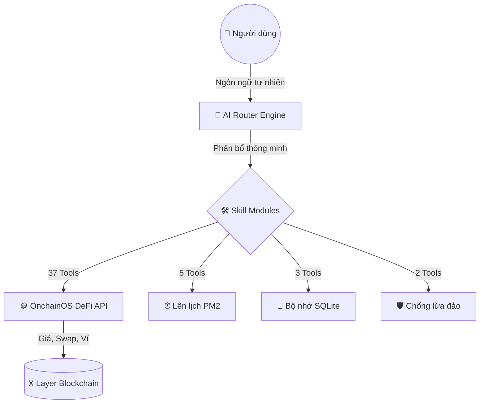

---

### 🚀 Hướng Dẫn Tự Triển Khai Từ A-Z

Hướng dẫn từng bước từ **con số 0** đến bot chạy 24/7 trên server riêng với tên miền tùy chỉnh.

#### Bước 1: Tạo Bot Telegram 🤖
1. Mở Telegram, tìm **[@BotFather](https://t.me/BotFather)**
2. Gửi `/newbot` → Đặt tên hiển thị → Đặt username (kết thúc bằng `bot`)
3. **Sao chép HTTP API Token** — lưu lại cẩn thận
4. Lấy **Telegram User ID**: nhắn tin cho [@userinfobot](https://t.me/userinfobot) → copy số `Id`

#### Bước 2: Lấy API Keys 🔑
- **OKX**: Vào [OKX Developer Portal](https://web3.okx.com/onchainos/dev-portal) → Tạo dự án → Lấy API Key, Secret Key, Passphrase
- **Gemini**: Vào [Google AI Studio](https://aistudio.google.com/apikey) → Tạo API Key (miễn phí)
- **OpenAI** (Tuỳ chọn): [platform.openai.com](https://platform.openai.com/api-keys)

#### Bước 3: Fork & Clone code 📦
```bash
# Fork repo này trên GitHub, rồi:
git clone https://github.com/TEN_BAN/xbot.git
cd xbot && npm install
```

#### Bước 4: Cấu hình .env ⚙️
```bash
cp .env.example .env
# Mở file .env bằng Notepad/nano, điền các key đã lấy ở bước 2
```
```env
TELEGRAM_TOKEN=token_telegram_cua_ban
BOT_OWNER_ID=user_id_telegram_cua_ban
GEMINI_API_KEY=key_gemini_cua_ban
WALLET_ENCRYPT_SECRET=chuoi_32_ky_tu_ngau_nhien_tu_dat
OKX_API_KEY=key_okx_cua_ban
OKX_SECRET_KEY=secret_okx_cua_ban
OKX_API_PASSPHRASE=mat_khau_okx_cua_ban
```

> 💡 **Mẹo**: Tạo chuỗi 32 ký tự ngẫu nhiên: `node -e "console.log(require('crypto').randomBytes(16).toString('hex'))"`

#### Bước 5: Chạy thử trên máy tính 🧪
```bash
node index.js   # Thấy ✅ là thành công, thử nhắn tin cho bot trên Telegram
```

#### Bước 6: Triển khai lên VPS Ubuntu 🖥️

**A) Mua VPS** (chọn hệ điều hành **Ubuntu 22.04 LTS**)

| Nhà cung cấp | Giá | Cấu hình |
|---------------|-----|----------|
| [Vultr](https://vultr.com) | $6/tháng | 1 vCPU, 1GB RAM |
| [DigitalOcean](https://digitalocean.com) | $4/tháng | 1 vCPU, 512MB RAM |
| [Hetzner](https://hetzner.com) | €3.79/tháng | 2 vCPU, 2GB RAM |
| [Contabo](https://contabo.com) | €4.99/tháng | 4 vCPU, 8GB RAM |

**B) Kết nối SSH vào VPS**
```bash
# Windows: dùng PowerShell hoặc PuTTY
# Mac/Linux: dùng Terminal
ssh root@DIA_CHI_IP_VPS_CUA_BAN
```
Nhập mật khẩu được nhà cung cấp VPS gửi qua email.

**C) Cài đặt phần mềm cần thiết**
```bash
# Cập nhật hệ thống
sudo apt update && sudo apt upgrade -y

# Cài Node.js 18
curl -fsSL https://deb.nodesource.com/setup_18.x | sudo -E bash -
sudo apt install -y nodejs git build-essential

# Kiểm tra
node --version   # Phải hiện v18.x.x

# Cài PM2 (quản lý tiến trình chạy 24/7)
sudo npm install -g pm2
```

**D) Clone code và cấu hình**
```bash
cd ~
git clone https://github.com/TEN_BAN/xbot.git
cd xbot && npm install
cp .env.example .env
nano .env    # Dán các key vào, lưu: Ctrl+X → Y → Enter
```

**E) Build Dashboard**
```bash
cd dashboard && npm install && npm run build && cd ..
```

**F) Khởi chạy bot 24/7**
```bash
pm2 start index.js --name xbot
pm2 startup     # Tự khởi động khi VPS reboot
pm2 save
```

**G) Cấu hình tường lửa**
```bash
sudo ufw allow 22 && sudo ufw allow 80 && sudo ufw allow 443
sudo ufw enable
```

> ✅ Bot đã chạy 24/7! Thử nhắn tin cho bot trên Telegram.

#### Bước 7: Tên miền riêng + SSL (Tuỳ chọn) 🌐

**A) Mua tên miền**: [Namecheap](https://namecheap.com) (~$8-12/năm) | [Cloudflare](https://cloudflare.com) | [GoDaddy](https://godaddy.com)

**B) Trỏ DNS**: Vào phần quản lý DNS của nhà cung cấp tên miền → Thêm bản ghi A:
```
Type: A    |  Name: @  |  Value: IP_VPS_CUA_BAN  |  TTL: Auto
```

**C) Cài Nginx + Cấu hình reverse proxy**
```bash
sudo apt install -y nginx
sudo nano /etc/nginx/sites-available/xbot
```
Dán nội dung sau:
```nginx
server {
    listen 80;
    server_name tenmiencuaban.com;
    location / {
        proxy_pass http://127.0.0.1:3000;
        proxy_http_version 1.1;
        proxy_set_header Upgrade $http_upgrade;
        proxy_set_header Connection 'upgrade';
        proxy_set_header Host $host;
        proxy_set_header X-Real-IP $remote_addr;
        proxy_set_header X-Forwarded-For $proxy_add_x_forwarded_for;
        proxy_set_header X-Forwarded-Proto $scheme;
        proxy_cache_bypass $http_upgrade;
    }
}
```
```bash
sudo ln -s /etc/nginx/sites-available/xbot /etc/nginx/sites-enabled/
sudo rm /etc/nginx/sites-enabled/default
sudo nginx -t && sudo systemctl restart nginx
```

**D) Cài SSL (HTTPS)**
```bash
sudo apt install -y certbot python3-certbot-nginx
sudo certbot --nginx -d tenmiencuaban.com
# Tự động gia hạn. Kiểm tra: sudo certbot renew --dry-run
```

> ✅ Dashboard giờ truy cập được tại `https://tenmiencuaban.com`!

#### Bước 8: Cập nhật code 🔄
```bash
cd ~/xbot && git pull origin main
npm install
cd dashboard && npm run build
cd .. && pm2 restart xbot
```

---

### 🌐 Bảng Điều Khiển Web

#### 👑 Trang Quản Trị (7 trang)
| Trang | Chức năng |
|---|---|
| 📊 **Tổng Quan** | Sức khỏe bot, RAM, độ trễ, hàng đợi |
| 👥 **Người Dùng** | Tìm kiếm, cấm/bỏ cấm, theo dõi hoạt động |
| 💬 **Nhóm** | Quản lý nhóm Telegram |
| 📈 **Phân Tích** | Biểu đồ, thống kê lệnh |
| 🔔 **Cảnh Báo** | Quản lý cảnh báo giá |
| 📅 **Bài Đăng** | Quản lý bài đăng định kỳ |
| ⚙️ **Cấu Hình** | API key (ẩn bảo mật) |

#### 👤 Trang Người Dùng (9 trang)
| Trang | Chức năng |
|---|---|
| 🤖 **Chat AI** | Chat AI real-time trên trình duyệt |
| 👤 **Hồ Sơ** | Thông tin Telegram & thống kê |
| 👛 **Ví** | Tạo/quản lý ví, số dư token |
| 📊 **Giao Dịch** | Báo giá, Gas, xếp hạng token |
| 💹 **OKX Trading** | Công cụ DeFi nâng cao |
| 📈 **AI Trader** | Giao dịch tự động, chế độ giả lập, bảng tín hiệu, vị thế, VWAP/DCA, xuất CSV |
| 🏆 **Xếp Hạng** | Bảng xếp hạng game |
| 🌐 **Social Hub** | Cộng đồng, bài viết, nhắn tin, xếp hạng |
| ⚙️ **Cài Đặt** | Tuỳ chọn người dùng |

---

### 🎮 Danh Sách Lệnh
* `/ai <nội dung>` - Chat AI | `/swap <từ> <sang> <số>` - Swap nhanh
* `/mywallet` - Quản lý ví | `/contract <địa chỉ>` - Tra cứu token
* `/meme` - Quét meme token | `/pnl` - Báo cáo lãi lỗ
* `/admin` - Quản lý cộng đồng | `/checkinadmin` - Cấu hình điểm danh
* `/sudoku` `/mines` `/memory` `/rps` `/dice` - Trò chơi

### 🧠 Sức Mạnh Trí Tuệ Nhân Tạo
<details>
<summary>Bấm xem ví dụ lệnh AI</summary>

* **"Giá ETH hiện tại?"** | **"Tìm token BANMAO"** | **"Token nào đang hot?"**
* **"Phân tích biểu đồ nến OKB"** | **"Ví cá mập hold SHIB nhiều nhất"**
* **"Đổi 0.1 ETH sang USDT"** | **"Swap 5 OKB từ tất cả ví sang USDT"**
* **"Tạo ví mới"** | **"Số dư ví tôi"** | **"Chuyển 2 OKB sang 0x123..."**
* **"Token này an toàn không? 0x1234..."** | **"15 phút ngó giá ETH 1 lần"**
* **"Nhớ là tôi thích giao dịch trên Solana"**

</details>

### ⚠️ Bảo Mật
- **Tuyệt đối không chia sẻ file `.env`** | Private key mã hoá AES-256-CBC
- Chỉ dùng `/exportkey` trong **DM** | AI từ chối giao dịch token lừa đảo
- Mô phỏng giao dịch trước khi phát sóng | Giới hạn 20 lệnh/phút

### 🛣️ Lộ Trình Phát Triển
- [x] Tối ưu X Layer | [x] Đa mô hình AI | [x] Web Dashboard
- [x] Quét Meme token | [x] PnL tracking | [x] Lịch sử DEX
- [x] Audit token | [x] Smart Money | [x] Transaction Explorer
- [x] Auto Trading Agent | [x] Copy Trading | [x] Trading Wizard
- [x] Arbitrage Scanner | [x] Plugin Marketplace | [x] Multi-Channel
- [x] Smart AI Chat | [x] Deep Research Pipeline
- [ ] Auto-sniper & tín hiệu on-chain tự động

### 🤝 Đóng Góp
Chào mừng mọi PR! Phát triển plugin trong `src/skills/` và mở Pull Request.

### 💖 Ủng Hộ
**Donate (EVM / XLayer / BSC / ETH):** `0x92809f2837f708163d375960063c8a3156fceacb`

</details>

---

<br>

<details>
<summary><h2>🇰🇷 한국어</h2></summary>

> 🤖 **라이브 데모**: [@XlayerAi_bot](https://t.me/XlayerAi_bot)에서 체험하세요. AI 활성화: `/api` → "Google API" → "Add API" ([키 받기](https://aistudio.google.com/api-keys)). 오픈소스 — 자체 인스턴스를 배포하세요!

### 🌟 핵심 기능
| 기능 | 설명 |
|:---|:---|
| 🔗 **X Layer 최적화** | OKX OnchainOS 모든 체인 지원, **X Layer** 심층 최적화 |
| 🌍 **다국어 지원** | 자동 언어 감지 및 자연스러운 응답 |
| 🤖 **멀티 AI** | **Gemini**, **OpenAI**, **Groq** 통합 |
| ⚙️ **하이브리드 운영** | AI 자연어 + 슬래시 명령어 폴백 |
| 🛡️ **허니팟 방어** | 스왑 전 토큰 스캔으로 사기 차단 |
| 🏦 **DeFi & OnchainOS** | 크로스체인 DEX 스왑, 실시간 데이터, 멀티 지갑 |
| 📈 **AI 트레이딩 에이전트** | 신호 기반 자동 트레이딩, VWAP/DCA, 트리플 배리어, 페이퍼 모드, 텔레그램 알림 |

<details>
<summary>🖼️ 스크린샷 12장 보기</summary>

1. **토큰 스왑** 
2. **자동 전송** 
3. **멀티 지갑 자산** 
4. **미니 게임** 
5. **컨트롤 패널** 
6. **지갑 생성** 
7. **스마트 머니 신호** 
8. **사용자 대시보드** 
9. **관리자 대시보드** 
10. **배치 스왑** 
11. **봇 방지 인증** 
12. **자동 가격 리포트** 
</details>

### 🏗️ 프로젝트 아키텍처
```
xbot/
├── src/                        # 백엔드 소스
│   ├── skills/                 # 🔌 플러그앤플레이 스킬 모듈
│   │   ├── onchain/            # 37개 DeFi 도구
│   │   ├── scheduler/          # 5개 백그라운드 도구
│   │   ├── memory/             # 3개 메모리 도구
│   │   └── security/           # 2개 보안 도구
│   ├── commands/               # 슬래시 명령어
│   ├── features/               # 기능 모듈
│   └── server/                 # API 서버
├── dashboard/                  # React 19 + Vite 6
└── tests/
```

### 🚀 셀프 호스팅 가이드

#### 1단계: 텔레그램 봇 생성 🤖
[@BotFather](https://t.me/BotFather) → `/newbot` → 이름/유저네임 설정 → **API Token 복사**

#### 2단계: API 키 획득 🔑
- **OKX**: [개발자 포털](https://web3.okx.com/onchainos/dev-portal) → 프로젝트 생성
- **Gemini**: [Google AI Studio](https://aistudio.google.com/apikey) → 무료 키 생성

#### 3~5단계: 코드 클론 & 설정
```bash
git clone https://github.com/YOUR_USERNAME/xbot.git
cd xbot && npm install
cp .env.example .env   # 키 입력
node index.js           # 로컬 테스트
```

#### 6단계: Ubuntu VPS 배포 🖥️
추천 VPS: Vultr ($6/월) | DigitalOcean ($4/월) | Hetzner (€3.79/월)
```bash
ssh root@VPS_IP
curl -fsSL https://deb.nodesource.com/setup_18.x | sudo -E bash -
sudo apt install -y nodejs git build-essential && sudo npm install -g pm2
cd ~ && git clone https://github.com/YOUR_USERNAME/xbot.git && cd xbot && npm install
cp .env.example .env && nano .env
cd dashboard && npm install && npm run build && cd ..
pm2 start index.js --name xbot && pm2 startup && pm2 save
sudo ufw allow 22 && sudo ufw allow 80 && sudo ufw allow 443 && sudo ufw enable
```

#### 7단계: 도메인 + SSL 🌐
> 영문 섹션의 Step 7을 참조하세요 (Nginx + Certbot 설정 동일)

### 🎮 명령어 | 🧠 AI 기능
* `/ai` AI 채팅 | `/swap` 스왑 | `/mywallet` 지갑 | `/meme` 밈 스캔 | `/pnl` 수익률
* AI: "ETH 가격?" "OKB 차트 분석" "0.1 ETH를 USDT로 스왑" "지갑 잔액 확인"

### ⚠️ 보안 | 🛣️ 로드맵
- `.env` 파일 공유 금지 | AES-256-CBC 암호화 | DM에서만 키 내보내기
- [x] 모든 주요 기능 완료 | [ ] 오토 스나이퍼 & 온체인 시그널

### 💖 후원
**기부 (EVM):** `0x92809f2837f708163d375960063c8a3156fceacb`

</details>

---

<br>

<details>
<summary><h2>🇷🇺 Русский</h2></summary>

> 🤖 **Демо**: Попробуйте [@XlayerAi_bot](https://t.me/XlayerAi_bot). Для AI: `/api` → "Google API" → "Add API" ([получить ключ](https://aistudio.google.com/api-keys)). Открытый исходный код — разверните свою копию!

### 🌟 Основные возможности
| Функция | Описание |
|:---|:---|
| 🔗 **X Layer** | Поддержка всех цепей OKX OnchainOS, оптимизация для **X Layer** |
| 🌍 **Мультиязычность** | Автоматическое определение языка и ответ |
| 🤖 **Мульти-AI** | **Gemini**, **OpenAI**, **Groq** |
| ⚙️ **Гибридный режим** | AI + slash-команды |
| 🛡️ **Защита от Honeypot** | Сканирование токенов перед свопом |
| 🏦 **DeFi** | Кросс-чейн свопы, кошельки, рыночные данные |
| 📈 **AI Торговый Агент** | Автотрейдинг по сигналам, VWAP/DCA, тройной барьер, бумажная торговля, уведомления Telegram |

<details>
<summary>🖼️ 12 скриншотов</summary>

1. **Свап токенов** 
2. **Быстрые переводы** 
3. **Мульти-кошелёк** 
4. **Мини-игры** 
5. **Панель управления** 
6. **Создание кошелька** 
7. **Сигналы Smart Money** 
8. **Дашборд пользователя** 
9. **Админ панель** 
10. **Пакетный свап** 
11. **Анти-бот защита** 
12. **Авто-отчёт цен** 
</details>

### 🚀 Руководство по развёртыванию

#### Шаг 1-2: Создать бота & получить ключи
- [@BotFather](https://t.me/BotFather) → `/newbot` → скопировать **API Token**
- [OKX](https://web3.okx.com/onchainos/dev-portal) → API ключи | [Gemini](https://aistudio.google.com/apikey) → бесплатный ключ

#### Шаг 3-5: Клонировать & настроить
```bash
git clone https://github.com/YOUR_USERNAME/xbot.git && cd xbot && npm install
cp .env.example .env   # Вставить ключи
node index.js           # Локальный тест
```

#### Шаг 6: Деплой на Ubuntu VPS 🖥️
Рекомендуемые VPS: Vultr ($6/мес) | DigitalOcean ($4/мес) | Hetzner (€3.79/мес)
```bash
ssh root@IP_СЕРВЕРА
curl -fsSL https://deb.nodesource.com/setup_18.x | sudo -E bash -
sudo apt install -y nodejs git build-essential && sudo npm install -g pm2
cd ~ && git clone https://github.com/YOUR_USERNAME/xbot.git && cd xbot && npm install
cp .env.example .env && nano .env
cd dashboard && npm install && npm run build && cd ..
pm2 start index.js --name xbot && pm2 startup && pm2 save
sudo ufw allow 22 && sudo ufw allow 80 && sudo ufw allow 443 && sudo ufw enable
```

#### Шаг 7: Домен + SSL 🌐
> См. английскую версию Step 7 (Nginx + Certbot — аналогично)

### 🎮 Команды | 🧠 AI
* `/ai` AI чат | `/swap` свап | `/mywallet` кошелёк | `/meme` мем-сканер | `/pnl` P&L
* AI: "Цена ETH?" "Анализ графика OKB" "Обменять 0.1 ETH на USDT"

### ⚠️ Безопасность
Не делитесь `.env` | AES-256-CBC шифрование | Только DM для экспорта ключей

### 💖 Поддержать
**Донат (EVM):** `0x92809f2837f708163d375960063c8a3156fceacb`

</details>

---

<br>

<details>
<summary><h2>🇮🇩 Bahasa Indonesia</h2></summary>

> 🤖 **Demo Langsung**: Coba di [@XlayerAi_bot](https://t.me/XlayerAi_bot). Aktifkan AI: `/api` → "Google API" → "Add API" ([dapatkan kunci](https://aistudio.google.com/api-keys)). Open source — deploy instance Anda sendiri!

### 🌟 Fitur Unggulan
| Fitur | Deskripsi |
|:---|:---|
| 🔗 **X Layer** | Mendukung semua chain OKX OnchainOS, dioptimalkan untuk **X Layer** |
| 🌍 **Multi-Bahasa** | Deteksi otomatis dan balas dalam bahasa pengguna |
| 🤖 **Multi-AI** | **Gemini**, **OpenAI**, **Groq** |
| ⚙️ **Mode Hybrid** | AI bahasa alami + slash command fallback |
| 🛡️ **Anti-Honeypot** | Scan token sebelum swap untuk blokir penipuan |
| 🏦 **DeFi** | Cross-chain swap, data real-time, multi-wallet |
| 📈 **AI Trading Agent** | Trading otomatis berbasis sinyal, VWAP/DCA, triple barrier, paper mode, notifikasi Telegram |

<details>
<summary>🖼️ Lihat 12 screenshot</summary>

1. **Swap Token** 
2. **Transfer Cepat** 
3. **Multi-Wallet** 
4. **Mini Games** 
5. **Panel Kontrol** 
6. **Buat Wallet** 
7. **Sinyal Smart Money** 
8. **Dashboard User** 
9. **Dashboard Admin** 
10. **Batch Swap** 
11. **Anti-Bot** 
12. **Laporan Harga Otomatis** 
</details>

### 🚀 Panduan Self-Hosting

#### Langkah 1-2: Buat bot & dapatkan kunci
- [@BotFather](https://t.me/BotFather) → `/newbot` → salin **API Token**
- [OKX](https://web3.okx.com/onchainos/dev-portal) → API keys | [Gemini](https://aistudio.google.com/apikey) → kunci gratis

#### Langkah 3-5: Clone & konfigurasi
```bash
git clone https://github.com/YOUR_USERNAME/xbot.git && cd xbot && npm install
cp .env.example .env   # Masukkan kunci
node index.js           # Test lokal
```

#### Langkah 6: Deploy ke Ubuntu VPS 🖥️
VPS Rekomendasi: Vultr ($6/bln) | DigitalOcean ($4/bln) | Hetzner (€3.79/bln)
```bash
ssh root@IP_VPS
curl -fsSL https://deb.nodesource.com/setup_18.x | sudo -E bash -
sudo apt install -y nodejs git build-essential && sudo npm install -g pm2
cd ~ && git clone https://github.com/YOUR_USERNAME/xbot.git && cd xbot && npm install
cp .env.example .env && nano .env
cd dashboard && npm install && npm run build && cd ..
pm2 start index.js --name xbot && pm2 startup && pm2 save
sudo ufw allow 22 && sudo ufw allow 80 && sudo ufw allow 443 && sudo ufw enable
```

#### Langkah 7: Domain + SSL 🌐
> Lihat bagian English Step 7 (Nginx + Certbot — langkah sama)

### 🎮 Perintah | 🧠 AI
* `/ai` Chat AI | `/swap` swap | `/mywallet` wallet | `/meme` scan meme | `/pnl` P&L
* AI: "Harga ETH?" "Analisis chart OKB" "Swap 0.1 ETH ke USDT"

### ⚠️ Keamanan
Jangan bagikan `.env` | Enkripsi AES-256-CBC | Ekspor key hanya di DM

### 💖 Dukung Kami
**Donasi (EVM):** `0x92809f2837f708163d375960063c8a3156fceacb`

</details>
