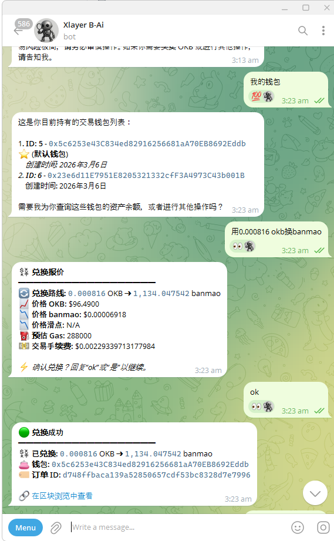
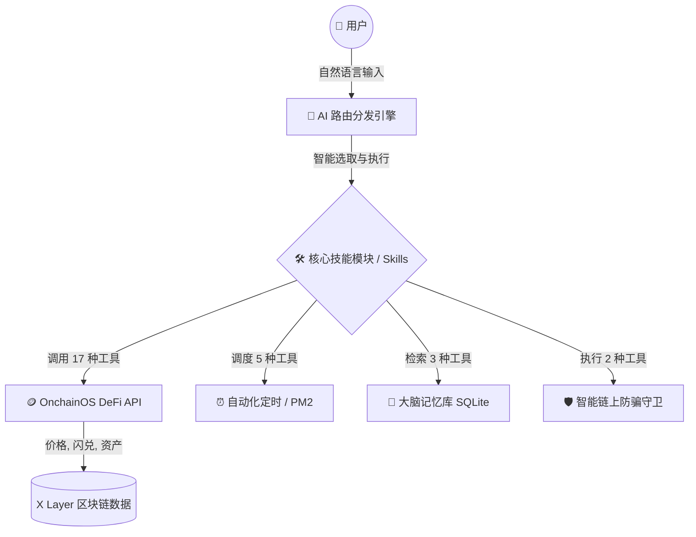
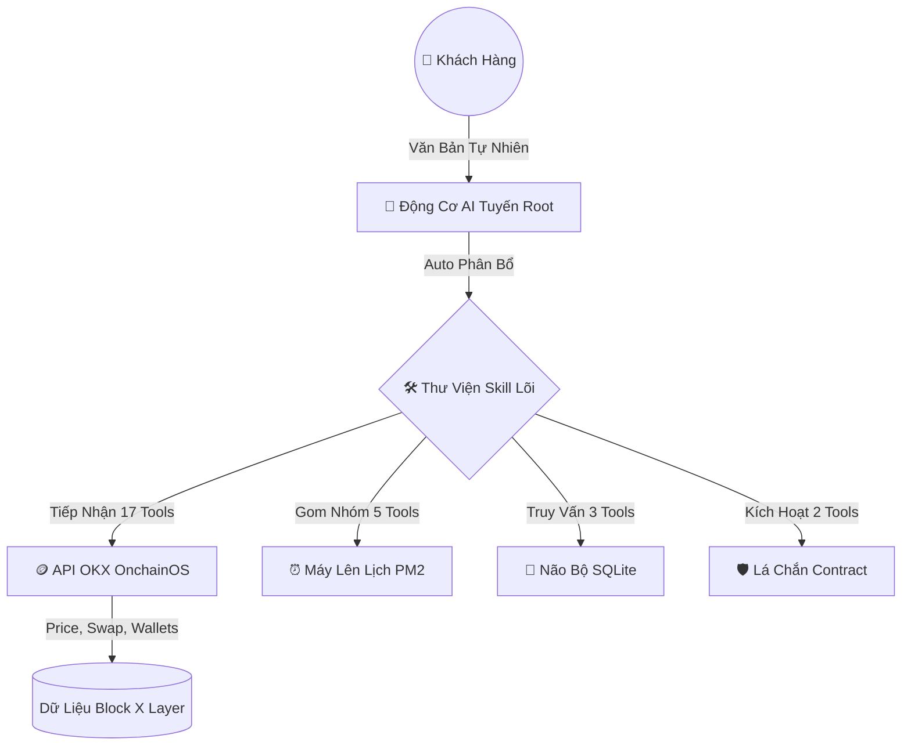
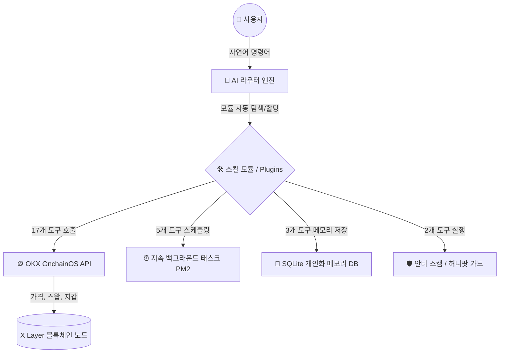
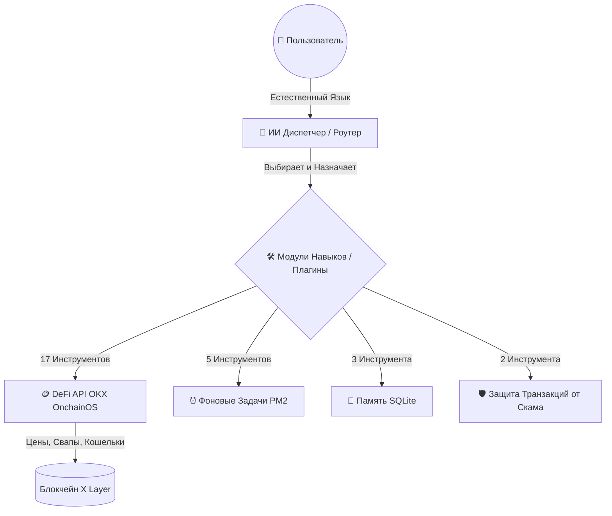
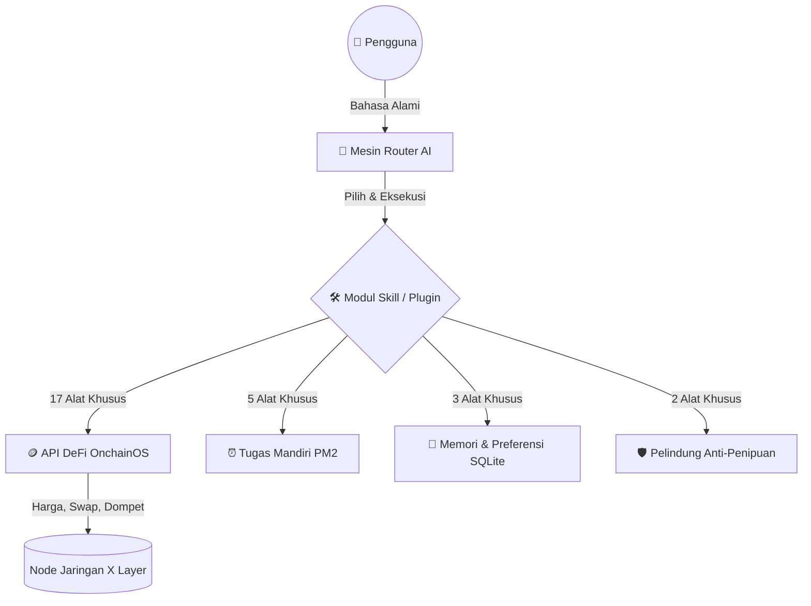

# 🐱🍌 XBot — The Ultimate AI-Powered Web3 Telegram Bot

<p align="center">
  
</p>

    

**[🇬🇧 English](#-english) | [🇨🇳 简体中文](#-简体中文) | [🇻🇳 Tiếng Việt](#-tiếng-việt) | [🇰🇷 한국어](#-한국어) | [🇷🇺 Русский](#-русский) | [🇮🇩 Bahasa Indonesia](#-bahasa-indonesia)**

---

<br>

<details open>
<summary><h2>🇬🇧 English</h2></summary>

> 🤖 **Live Public Instance**: A hosted version of XBot, maintained by our core development team, is currently running on a dedicated Virtual Private Server (VPS) and is available for public interaction at [@XlayerAi_bot](https://t.me/XlayerAi_bot). While you are welcome to experience its capabilities firsthand through this public instance, XBot is fundamentally designed as a flexible, open-source framework. We highly encourage developers, project founders, and community leaders to deploy, configure, and customize their own sovereign instances on personal VPS environments tailored to their bespoke use cases. By doing so, you can unlock its full potential and join us in collectively expanding and enriching the broader X Layer ecosystem.

### 🌟 Features at a Glance

| Feature | Description |
| :--- | :--- |
| 🔗 **X Layer Optimized** | Seamlessly supports all blockchains integrated with OKX OnchainOS, with deep optimization for **X Layer** natively. |
| 🌍 **Dynamic Multi-Language** | Automatically understands context and replies smoothly in the user's spoken language without hardcoded templates. |
| 🤖 **Multi-Model AI** | Powered by **Google Gemini**, **OpenAI**, and **Groq** for complex logical comprehension and flawless NLP. |
| ⚙️ **Hybrid Operation** | Operates autonomously via AI natural language, or gracefully falls back to manual slash commands when needed. |
| 🛡️ **Honeypot Protection** | Scans tokens dynamically before swaps to block rug-pulls, 100% tax scams, and extreme slippage conditions. |
| 🏦 **DeFi & OnchainOS** | Instant cross-chain DEX Swaps, real-time market data, and complete multi-wallet asset management. |

### 🖼️ Natural Language Trading Showcase

*Example: The AI autonomously interpreting a Chinese natural language request to quote and swap OKB for BANMAO, displaying all fees, slippage, and TX success hashes seamlessly.*

### 🎮 Command Reference
#### 🤖 AI Chat (Natural Language)
Just chat naturally with the bot! It understands context and uses **40+ tools automatically**.
* `/ai <message>` - Chat with Gemini (Default)
* `/aib <message>` - Chat with custom behavior rules
* `/ai provider` - Switch AI provider (Gemini / Groq / OpenAI)

#### 💰 Wallet & DeFi (Manual)
* `/mywallet` - Open trading wallet manager
* `/swap <from> <to> <amount>` - Quick swap tokens manually
* `/contract <address>` - Lookup token info by contract address
* `/toptoken` - View trending tokens with rich UI

#### 🛡️ Moderation & Community (Group Admins)
* `/price`, `/pricev`, `/pricex` - **Scheduled token price alerts tailored to each group's language to maximize community engagement.**
* `/checkin` - Daily check-in system with quizzes to earn points
* `/ban`, `/mute`, `/warn` - Community moderation tools
* `/welcome` - Configurable welcome messages

#### 🎲 Games
* `/sudoku`, `/mines`, `/memory`, `/rps`, `/dice` - Play engaging mini-games within Telegram.

### 🧠 Advanced AI Capabilities (Natural Language)
The AI engine runs completely autonomously and understands complex, multi-step operations. You don't need to memorize slash commands, just talk to it!

#### 💰 1. Price & Search
* **"What is the current price of ETH?"** *(Real-time native token price)*
* **"Price of OKB on X Layer"** *(Test specific token on specific chain)*
* **"Search for BANMAO token"** *(Auto-search token contract)*
* **"What are the top trending tokens today?"** *(get_top_tokens)*
* **"Give me a detailed market analysis for BANMAO token"** *(Deep market detail)*

#### 📊 2. Technical Analysis
* **"Analyze the candlestick chart for OKB"** *(RSI, EMA, k-line trend)*
* **"Show me the 30-day candlestick chart for BTC"** *(Historical candles)*
* **"Show statistics of top SHIB holders"** *(Token holders)*
* **"Show recent buy/sell transactions for BANMAO token"** *(Recent trades)*

#### 🔄 3. Trading & Swap (Secure)
> ⚠️ The AI will automatically check for honeypots, high tax rates, and price impact before executing any swap.

* **"Get a swap quote for 10 USDT to OKB on X Layer"** *(Just check price)*
* **"I want to swap 0.1 ETH for USDT"** *(Get quote, check honeypot, and show confirmation button)*
* **"Batch swap 5 OKB from all my wallets to USDT"** *(Simulate batch swap)*
* **"Check current gas price on ETH network"** *(Gas price)*

#### 👛 4. Wallet Management
* **"Create a new trading wallet for me"** *(Generate wallet, set default, send PK)*
* **"What is my current wallet balance?"** *(Scan default wallet asset)*
* **"List all my wallets"** *(List trading wallets)*
* **"Transfer 2 OKB to 0x123...456"** *(Transfer tokens)*
* **"Transfer all 100 USDT from sub-wallet #2 to main wallet"** *(Batch transfer)*
* **"Show my PnL report for the last 7 days"** *(Wallet PnL)*
* **"Security: Export all my private keys"** *(Export keys directly to DM)*

#### 🛡️ 5. Security Checks
* **"Is this token safe? 0x1234..."** *(Check honeypot & risks)*
* **"Check if PEPE is a honeypot"**
* **"Check approval safety for this spender address"**

#### ⏰ 6. Scheduled Tasks (Autonomous Agent)
* **"Watch ETH price every 15 minutes"** *(Auto-monitor)*
* **"Alert me if BTC changes more than 5%"**
* **"Snapshot my portfolio every 6 hours"**
* **"Remind me in 30 minutes to check BANMAO"**

#### 🧠 7. Memory & Preferences
* **"Remember that I prefer trading on Solana"** *(Save preference)*
* **"My risk tolerance is low"**
* **"What are my saved preferences?"**

### 🔧 Skill Engine Architecture
The bot uses a strict plug-and-play skill engine. Each feature is a self-contained module ensuring high maintainability and security separation.


### 📊 Tech Stack
| Component | Technology |
|-----------|------------|
| Runtime | Node.js 18+ |
| Telegram | node-telegram-bot-api |
| AI | Gemini (primary), Groq, OpenAI |
| Blockchain | OKX OnchainOS API, ethers.js |
| Database | SQLite3 |
| Queue | BullMQ (Redis) / In-memory fallback |
| Process Manager | PM2 |

### ⚠️ Security Protocols
- **Never share your `.env` file** — it contains API keys and secrets.
- **Private keys** are encrypted at rest in the database.
- Use `/exportkey` and `/importkey` only in **DM** (direct message).
- The AI **refuses** to execute trades on detected honeypot tokens.
- Transaction simulation is available to verify tx safety before broadcasting.
- Per-user rate limiting actively prevents API abuse (20 calls/minute).

### 📝 PM2 Maintenance Commands
```bash
pm2 start index.js --name xbot    # Start bot
pm2 restart xbot                   # Restart bot
pm2 stop xbot                      # Stop bot
pm2 logs xbot                      # View live logs
pm2 flush                          # Clear log cache
```

### 📦 Beginner's Installation Guide
**Step 1: Install Prerequisites**
1. Download and install [Node.js](https://nodejs.org/) (Version 18 or higher).
2. Download and install [Git](https://git-scm.com/).

**Step 2: Clone the Bot**
Open your terminal (Command Prompt/PowerShell) and run:
```bash
git clone https://github.com/YOUR_USERNAME/xbot.git
cd xbot
npm install
```

**Step 3: Get Your API Keys**
1. **Telegram:** Message [@BotFather](https://t.me/BotFather) on Telegram, create a new bot, and copy the `HTTP API Token`.
2. **OKX:** Go to the [OKX Developer Portal](https://web3.okx.com/onchainos/dev-portal) and generate your API Key, Secret Key, and Passphrase.
3. **AI:** Get a free API key from [Google AI Studio (Gemini)](https://aistudio.google.com/).

**Step 4: Configure the Bot**
Rename `.env.example` to `.env` and paste your keys into it:
```env
TELEGRAM_TOKEN=your_telegram_bot_token
BOT_OWNER_ID=your_telegram_username
GEMINI_API_KEY=your_gemini_api_key
WALLET_ENCRYPT_SECRET=your_32_character_random_secret_string_here
OKX_API_KEY=your_okx_api_key
OKX_SECRET_KEY=your_okx_secret_key
OKX_API_PASSPHRASE=your_okx_passphrase
```

**Step 5: Run the Bot**
```bash
# For testing locally:
node index.js

# For long-term 24/7 hosting (Recommended):
npm install -g pm2
pm2 start index.js --name xbot
```

### 🛣️ Project Roadmap
- [x] Integrate X Layer network optimization natively.
- [x] Support multiple AI engines (Gemini, Groq, OpenAI).
- [x] Release structural framework for Open Source community.
- [ ] Auto-sniper features and automated Onchain trading signals.
- [ ] Build a sleek Telegram Mini App (Web-App) for visual portfolio management.

### 🤝 Contributing
We welcome all Pull Requests! 
XBot is built to be extremely modular. If you have a cool idea for a new plugin (Skill) — whether it's an NFT sniper, meme coin deployer, or casino game — feel free to Fork the repository, build your tool inside `src/skills/`, and open a Pull Request.

### 💖 Sponsor & Support
If this bot has helped you launch your project or trade faster on X Layer, please consider supporting the development! Every cup of coffee helps keep the AI models running.
**Donate (EVM / XLayer / BSC / ETH):** 
`0x92809f2837f708163d375960063c8a3156fceacb`

</details>

---

<br>

<details>
<summary><h2>🇨🇳 简体中文</h2></summary>

> 🤖 **官方公共体验版**: 目前，由核心开发团队维护的机器人公开版本正运行在专用的虚拟专用服务器 (VPS) 上，欢迎前往 [@XlayerAi_bot](https://t.me/XlayerAi_bot) 互动并体验其强大的功能。尽管这个公共实例向所有人开放，但 XBot 在本质上是一个高度模块化的开源框架。我们强烈鼓励广大开发者、项目创始人和社区管理员在个人的 VPS 环境中部署、配置并深度定制属于自己的专属机器人，以满足各种个性化的业务场景。我们期待您的加入，共同释放开源的力量，携手推动并繁荣整个 X Layer 生态系统。

### 🌟 核心亮点概览

| 功能特性 | 详情描述 |
| :--- | :--- |
| 🔗 **X Layer 专属优化** | 完美支持所有接入 OKX OnchainOS 的区块链，并针对 **X Layer** 进行了深度底层优化。 |
| 🌍 **动态多语言交互** | 自动识别语境并使用用户的母语进行极其流畅的自然回复，告别硬编码模板。 |
| 🤖 **多维 AI 大模型** | 由 **Google Gemini**、**OpenAI** 和 **Groq** 强力驱动，具备卓越的逻辑理解与自然语言处理能力。 |
| ⚙️ **混合双引擎运行** | 既可通过 AI 自然语言全自动运行，也能在必要时极其平滑地降级至手动斜杠指令。 |
| 🛡️ **貔貅盘深度防御** | 在交易前动态扫描代币合约，智能拦截貔貅盘、100% 杀手税及极端滑点异常。 |
| 🏦 **DeFi 与数字资产** | 瞬时跨链 DEX 闪兑、实时全网行情数据、以及全方位的多钱包聚合管理。 |

### 🖼️ AI 自然语言交易引擎演示

*示例：AI 引擎自主理解纯中文指令，计算 OKB 兑换 BANMAO 的汇率，并无缝展示滑点、Gas 费与链上确认结果。*

### 🎮 指令参考
#### 🤖 AI 对话 (自然语言交互)
只需像和真人聊天一样与机器人对话，它能理解上下文并**自动调用 40+ 种区块链工具**。
* `/ai <内容>` - 与 Gemini 聊天（默认）
* `/aib <内容>` - 使用自定义规则进行对话
* `/ai provider` - 切换 AI 提供商（Gemini / Groq / OpenAI）

#### 💰 钱包与 DeFi (手动指令)
* `/mywallet` - 打开交易钱包管理器
* `/swap <输入> <输出> <数量>` - 手动快捷闪兑代币
* `/contract <合约地址>` - 根据合约地址查询代币详情
* `/toptoken` - 查看具有精美 UI 的热门代币榜单

#### 🛡️ 社群管理与互动 (群管功能)
* `/price`, `/pricev`, `/pricex` - **定时通报代币价格指令，支持针对不同社群语言进行播报，极大增强社区互动与留存。**
* `/checkin` - 每日签到与答题赚积分系统
* `/ban`, `/mute`, `/warn` - 专业的群聊审核工具
* `/welcome` - 可自定义的进群欢迎语

#### 🎲 小游戏
* `/sudoku`, `/mines`, `/memory`, `/rps`, `/dice` - 在 Telegram 内爽玩各种互动小游戏。

### 🧠 强大的 AI 自然语言对话能力
AI 引擎可完全自主运行，并理解复杂的多步骤操作逻辑。您无需死记硬背枯燥的斜杠指令，只需像和真人聊天一样与它对话！

#### 💰 1. 价格与代币搜索
* **"ETH 当前价格是多少？"** *(实时原生代币价格)*
* **"X Layer 网络上的 OKB 价格"** *(特定链上的代币价格)*
* **"搜索 BANMAO 代币"** *(自动搜索代币合约)*
* **"今天涨幅最高的代币有哪些？"** *(热门代币排行)*
* **"详细分析 BANMAO 代币的市场情况"** *(深度市场详情)*

#### 📊 2. 技术与数据分析
* **"分析 OKB 的 K 线图"** *(RSI, EMA, K 线趋势走向)*
* **"显示 BTC 过去 30 天的 K 线图"** *(历史 K 线)*
* **"统计 SHIB 持币大户的分布信息"** *(代币巨鲸持有者)*
* **"查看 BANMAO 代币最近的买卖交易记录"** *(近期交易历史)*

#### 🔄 3. 安全的交易与跨链闪兑
> ⚠️ 核心保障：AI 会在执行任何兑换前自动检测 "貔貅盘" (Honeypot)、是否带有高额扣税，并进行价格滑点影响分析。

* **"获取在 X Layer 上将 10 USDT 兑换为 OKB 的报价"** *(仅查询兑换比例)*
* **"我想用 0.1 ETH 兑换 USDT"** *(获取报价，执行防貔貅监测，并弹出确认执行按钮)*
* **"从我所有的子钱包里，批量将 5 OKB 兑换为 USDT"** *(高级批量闪兑模拟)*
* **"检查当前 ETH 网络的 Gas 费"** *(Gas 消耗一览)*

#### 👛 4. 钱包资产管理
* **"帮我创建一个新的交易钱包"** *(自动生成新钱包，设为默认，并将私钥发送至私聊)*
* **"我当前的钱包内余额是多少？"** *(扫描默认钱包全部资产)*
* **"列出我所有的交易钱包"** *(管理多个衍生钱包)*
* **"帮我转账 2 OKB 到 0x123...456 这个地址"** *(快速代币转账)*
* **"将 2 号子钱包里的所有 100 USDT 内部归集到主钱包"** *(高级批量资产归集)*
* **"显示我过去 7 天的 PnL (盈亏报表)"** *(钱包投资盈亏分析)*
* **"安全指令：导出我所有的钱包私钥"** *(高度安全：仅会在私聊中为您导出私钥)*

#### 🛡️ 5. 安全风控检查
* **"这个代币安全吗？0x1234..."** *(检查代币合约是否存在风险)*
* **"检查 PEPE 是否是貔貅盘骗局"**
* **"检查这个授权地址 (Spender) 的安全性"**

#### ⏰ 6. 自动化定时任务 (AI 代理)
* **"每 15 分钟监控一次 ETH 价格"** *(周期性自动监控预警)*
* **"如果 BTC 价格异动幅度超过 5%，请立即提醒我"**
* **"每 6 小时快照总结一次我的资产组合盈亏"**
* **"30 分钟后提醒我查看 BANMAO 走势"**

#### 🧠 7. 记忆与个性化偏好
* **"记住我平时更喜欢在 Solana 网络上交易"** *(长期保存偏好至大脑)*
* **"请注意，我的风险承受能力很低"**
* **"我现在保存了哪些 AI 偏好设置？"**

### 🔧 模块化插件架构 (Skill Engine)
该机器人采用了高度解耦的 "即插即用" 技能引擎。每个功能都是一个独立的模块，极大地保证了后期维护与运行安全的隔离性。



### 📊 技术栈架构
| 组件分类 | 采用技术 |
|-----------|------------|
| 运行环境 | Node.js 18+ |
| 通讯框架 | node-telegram-bot-api |
| AI 模型核心 | Gemini (主引擎), Groq, OpenAI |
| 区块链核心 | OKX OnchainOS API, ethers.js |
| 数据库 | SQLite3 |
| 任务队列 | BullMQ (Redis) / 内存阵列降级方案 |
| 进程守护 | PM2 |

### ⚠️ 安全协议与防范须知
- **绝不要向任何人泄露您的 `.env` 配置文件** — 里面包含了高度机密的 API 密钥。
- 所有的 **钱包私钥 (Private Keys)** 在录入数据库时均经过了复杂的加密层处理。
- 请仅在 **私聊 (DM)** 环境下使用 `/exportkey` 和 `/importkey` 指令。
- 机器人内部封锁了异常代币，AI **绝对拒绝** 在已检测出的貔貅盘上执行任何资金买入。
- 所有上链的资金变动前均提供本地模拟器功能，确认 TX 安全无误后再广播至矿工网络。

### � PM2 运维指令速查表
```bash
pm2 start index.js --name xbot    # 后台启动机器人
pm2 restart xbot                   # 重启机器人
pm2 stop xbot                      # 停止运行
pm2 logs xbot                      # 实时查看运行日志
pm2 flush                          # 清理历史冗余日志记录
```

### 📦 新手安装指南（保姆级教程）
**第一步：安装运行环境**
1. 下载并安装 [Node.js](https://nodejs.org/)（需 18 或以上版本）。
2. 下载并安装 [Git](https://git-scm.com/) 代码管理工具。

**第二步：拉取源码文件**
打开终端（命令提示符/PowerShell），依次输入以下命令：
```bash
git clone https://github.com/您在Github的用户名/xbot.git
cd xbot
npm install
```

**第三步：获取必要的 API 密钥**
1. **Telegram:** 在电报上向 [@BotFather](https://t.me/BotFather) 发送消息，创建新机器人并复制 `HTTP API Token`。
2. **OKX:** 前往 [OKX Web3 开发者平台](https://web3.okx.com/onchainos/dev-portal) 生成您的 API Key、Secret Key 和 Passphrase。
3. **AI:** 前往 [Google AI Studio (Gemini)](https://aistudio.google.com/) 申请免费的 API 密钥。

**第四步：配置机器人**
将文件夹中的 `.env.example` 重命名为 `.env`，然后使用记事本打开并填入您的密钥：
```env
TELEGRAM_TOKEN=填入您的Telegram_Token
BOT_OWNER_ID=填入您的Telegram用户名
GEMINI_API_KEY=填入您的Gemini密钥
WALLET_ENCRYPT_SECRET=在此处填入由您生成的32位随机字母数字混合秘钥
OKX_API_KEY=填入您的OKX_API_Key
OKX_SECRET_KEY=填入您的OKX_Secret_Key
OKX_API_PASSPHRASE=填入您的OKX密码
```

**第五步：启动机器人**
```bash
# 方便本地测试运行：
node index.js

# 用于服务器 24 小时后台挂机（强烈推荐）：
npm install -g pm2
pm2 start index.js --name xbot
```

### 🛣️ 项目发展蓝图 (Roadmap)
- [x] 原生深度集成 X Layer 网络底层支持
- [x] 对接多模态大语言模型 (Gemini, Groq, OpenAI)
- [x] 向开源社区重构并释放标准框架代码
- [ ] 开发自动打狗狙击 (Auto-sniper) 与链上信号自动播报系统
- [ ] 搭建直观优雅的 Telegram Web-App 资产管理端

### 🤝 参与开源贡献
我们热烈欢迎任何人发起 Pull Request！
XBot 的核心代码基于高内聚低耦合的架构打造。无论您是想添加一个抢狗脚本 (Sniper)、发币脚本，还是一个赌场小游戏，只需复制一份源码并在 `src/skills/` 中开发您的插件即可。

### 💖 赞助与支持 (Sponsor)
如果这个开源项目帮助您在 X Layer 上抓住了百倍币、或是提升了您的交易速度，欢迎打赏一杯咖啡来支持未来的 AI 算力开销！
**赞助地址 (支持 EVM / XLayer / BSC / ETH 等网络):** 
`0x92809f2837f708163d375960063c8a3156fceacb`

</details>

---

<br>

<details>
<summary><h2>🇻🇳 Tiếng Việt</h2></summary>

> 🤖 **Phiên Bản Trải Nghiệm Thực Tế**: Hiện tại, một phiên bản trực tiếp của bot đang được đội ngũ phát triển nòng cốt duy trì và vận hành liên tục 24/7 trên một máy chủ ảo (VPS) chuyên dụng. Quý vị có thể trực tiếp trải nghiệm sức mạnh của trí tuệ nhân tạo và các tính năng giao dịch tại địa chỉ [@XlayerAi_bot](https://t.me/XlayerAi_bot). Mặc dù phiên bản công khai này luôn sẵn sàng để phục vụ cộng đồng, chúng tôi muốn nhấn mạnh rằng XBot về bản chất là một nền tảng mã nguồn mở mang tính tùy biến cực cao. Chúng tôi đặc biệt khuyến khích các nhà phát triển, các nhà sáng lập dự án và quản trị viên cộng đồng tự tay cài đặt, thiết lập và cá nhân hóa bot trên hệ thống VPS của riêng mình nhằm phục vụ cho những mục đích và định hướng chiến lược riêng biệt. Hãy cùng chung tay xây dựng, phát triển và mở rộng hệ sinh thái X Layer ngày một vững mạnh và phồn vinh hơn.

### 🌟 Tính Năng Nổi Bật

| Tính Năng | Báo Cáo Chi Tiết |
| :--- | :--- |
| 🔗 **Tối Ưu Native X Layer** | Tương thích hoàn hảo với mọi Chain của OKX OnchainOS, siêu tối ưu kiến trúc lõi dành riêng cho **X Layer**. |
| 🌍 **Đa Ngôn Ngữ Động (Dynamic I18n)** | Nhận diện ngữ cảnh và phản hồi bằng ngôn ngữ người dùng đang chat mượt mà, từ chối việc xài Temp cứng. |
| 🤖 **Đa Mô Hình AI Lõi** | Tích hợp **Google Gemini**, **OpenAI** và **Groq** để tư duy logic và phân tích ngôn ngữ tự nhiên (NLP) siêu cấp. |
| ⚙️ **Động Cơ Kép (Hybrid)** | AI tự hành hoàn toàn bằng Text, nhưng vẫn có khả năng Fallback mượt mà sang Slash-Command nếu đứt kết nối mạng lõi. |
| 🛡️ **Lá Chắn Chống Honeypot** | Quét sống (Live) Contract Token để chặn trước các vụ kéo thảm, phí thuế giết người 100%, hoặc lỗi giá trượt. |
| 🏦 **DeFi & OnchainOS Xuyên Chuỗi** | Swap DEX liên chain chớp nhoáng, soi giá thị trường Real-time, quản trị tập trung hàng loạt ví phụ. |

### 🖼️ Minh Họa AI Xử Lý Lệnh Tự Nhiên

*Ví dụ: Mô hình AI tự động hiểu ý định người dùng, báo giá Swap OKB sang BANMAO, tính toán Gas phí và Slippage trơn tru trước khi chốt đơn.*

### 🎮 Danh Sách Lệnh
#### 🤖 Trò Chuyện AI (Tự Nhiên)
Bạn chỉ cần nhắn tin bình thường! Bot có khả năng tư duy ngữ cảnh và **tự động vận hành hơn 40 công cụ Onchain**.
* `/ai <nội dung>` - Chat với Gemini (Mặc định)
* `/aib <nội dung>` - Chat với các quy tắc hành vi tùy chỉnh
* `/ai provider` - Đổi cổng AI (Gemini / Groq / OpenAI)

#### 💰 Ví & Giao Dịch DeFi (Thủ Công)
* `/mywallet` - Mở bảng quản lý ví giao dịch
* `/swap <từ> <sang> <số lượng>` - Lệnh Swap nhanh thủ công
* `/contract <địa chỉ>` - Kiểm tra mọi thông tin của Token qua địa chỉ Contract
* `/toptoken` - Xem bảng xếp hạng Token đang hot với giao diện cực đẹp

#### 🛡️ Quản Lý Nhóm & Tương Tác Cộng Đồng
* `/price`, `/pricev`, `/pricex` - **Lệnh báo giá token theo thời gian đặt sẵn, tùy chỉnh theo từng ngôn ngữ của nhóm để gia tăng tối đa sự gắn kết và tương tác cộng đồng.**
* `/checkin` - Hệ thống điểm danh hàng ngày kèm câu đố nhận điểm
* `/ban`, `/mute`, `/warn` - Bộ công cụ quản trị nhóm chống spam mạnh mẽ
* `/welcome` - Cài đặt lời chào mừng thành viên mới

#### 🎲 Trò Chơi Giải Trí
* `/sudoku`, `/mines`, `/memory`, `/rps`, `/dice` - Chơi game giải trí tương tác cao ngay trong Telegram.

### 🧠 Sức Mạnh Trí Tuệ Nhân Tạo (Giao tiếp tự nhiên)
Động cơ AI có khả năng hoạt động hoàn toàn tự chủ và hiểu được những tư duy logic đa bước vô cùng phức tạp. Bạn không cần phải ghi nhớ bất kỳ câu lệnh (slash command) khô khan nào, cứ việc trò chuyện như với con người!

#### 💰 1. Kiểm Tra Giá & Tra Cứu Token
* **"Giá hiện tại của đồng ETH là bao nhiêu?"** *(Giá Token Native thời gian thực)*
* **"Tra giá OKB trên mạng X Layer"** *(Cụ thể hoá Token và Chain)*
* **"Tìm kiếm đồng BANMAO"** *(Tự động dò tìm địa chỉ Contract chuẩn xác)*
* **"Hôm nay có những đồng coin nào đang bay mạnh nhất?"** *(Bảng xếp hạng xu hướng)*
* **"Phân tích thị trường chi tiết cho đồng BANMAO giúp tôi"** *(Phân tích Market chuyên sâu)*

#### 📊 2. Phân Tích Kỹ Thuật (Technical Analysis)
* **"Phân tích biểu đồ nến k-line cho OKB"** *(Chỉ báo RSI, EMA, xu hướng)*
* **"Cho tôi xem biểu đồ nến 30 ngày qua của BTC"** *(Lịch sử đồ thị giá)*
* **"Thống kê những ví cá mập đang hold SHIB nhiều nhất"** *(Top Holders)*
* **"Hiển thị các lệnh mua bán nội bộ gần đây của đồng BANMAO"** *(Lịch sử lệnh khối lượng lớn)*

#### 🔄 3. Giao Dịch & Swap Xuyên Chuỗi (Bảo mật 100%)
> ⚠️ Bảo Vệ Tiền Của Bạn: Trí tuệ nhân tạo sẽ tự động rà quét kiểm tra mã độc "Honeypot" (Mạng nhện lừa đảo hút thanh khoản), kiểm tra mức thuế ẩn và tính toán tỷ lệ trượt giá (Price Impact) trước khi thực thi bất kỳ lệnh Swap nào.

* **"Tính giá cho tôi nếu lấy 10 USDT đổi sang OKB trên mạng X Layer"** *(Chỉ xem trước tỷ giá)*
* **"Tôi muốn dùng 0.1 ETH để mua USDT nhé"** *(Nhận báo giá, kiểm tra an toàn, và hiển thị nút chốt đơn)*
* **"Thực hiện dồn tiền đổi 5 OKB từ toàn bộ các ví phụ sang USDT"** *(Giả lập Swap dồn tiền khối lượng lớn)*
* **"Check phí Gas hiện tại trên mạng ETH"** *(Kiểm tra phí mạng)*

#### 👛 4. Quản Lý Ví Thông Minh
* **"Tạo cho tôi một ví giao dịch mới"** *(Tự động sinh ví, set ví làm mặc định, gửi Private Key vào trò chuyện kín)*
* **"Hiện tại trong ví tôi đang có tổng cộng bao nhiêu tiền?"** *(Quét toàn bộ tài sản ví)*
* **"Liệt kê tất cả các ví của tôi"** *(Danh sách hệ thống ví phụ)*
* **"Chuyển 2 OKB qua địa chỉ 0x123...456"** *(Lệnh chuyển tiền nhanh)*
* **"Gom toàn bộ 100 USDT từ ví phụ số 2 ném sang ví chính"** *(Chuyển tiền nội bộ siêu tốc)*
* **"Hiện cáo cáo lãi lỗ PnL của tôi trong 7 ngày qua"** *(Lịch sử lợi nhuận đầu tư)*
* **"Lệnh Bảo Mật: Xuất toàn bộ Private Key của tôi"** *(Độ an toàn cấp Quốc phòng: Chỉ gửi key qua môi trường nhắn tin riêng tư)*

#### 🛡️ 5. Quét Rủi Ro An Ninh An Toàn Thông Tin
* **"Đồng này có an toàn để mua không? 0x1234..."** *(Rà quét Contract có dính bẫy thanh khoản scam hay không)*
* **"Mày check hộ tao xem con PEPE có phải Honeypot không"**
* **"Kiểm tra xem cái địa chỉ ví ủy quyền này có rủi ro ăn trộm tiền không"**

#### ⏰ 6. Trợ Lý Lên Lịch Thay Mặt Tự Động (Auto-Agent)
* **"Cứ 15 phút mày ngó giá ETH một lần cho tao"** *(Theo dõi thị trường tuần hoàn liên tục)*
* **"Báo động khẩn nếu giá BTC sập quá 5%"**
* **"Cứ 6 tiếng chụp lại tổng tài sản ví của tao 1 lần nghen"**
* **"30 phút nữa nhắc tao vào xem giá BANMAO"**

#### 🧠 7. Bộ Não Lưu Trữ Sở Thích (Memory & Preferences)
* **"Hãy nhớ là tao thích giao dịch trên mạng Solana hơn nhé"** *(Lưu vĩnh viễn hệ tư tưởng vào rễ Memory của bot)*
* **"Khẩu vị rủi ro dạo này của mình rất thấp"**
* **"Trí nhớ của mày hiện đang lưu lại cài đặt riêng tư gì của tao vậy?"**

### 🔧 Kiến Trúc Hệ Thống Lõi (Skill Engine)
Bot được lập trình dựa trên khung cấu trúc siêu "Mở". Mỗi công cụ là một thực thể cô lập nằm ngầm, giúp mọi thứ dễ bảo trì và siêu bảo mật.



### 📊 Bảng Công Nghệ Trang Bị (Tech Stack)
| Thành Phần Dữ | Công Nghệ Áp Dụng |
|-----------|------------|
| Môi trường lõi | Node.js 18+ |
| Kênh tương tác | node-telegram-bot-api |
| Mô hình Não Phải AI | Gemini (Core chính), Groq, OpenAI |
| Cổng giao tiếp Tiền Ảo | OKX OnchainOS API, ethers.js |
| Data dữ liệu tĩnh | SQLite3 |
| Xếp tải tiến trình ngầm | BullMQ (Redis) / Trạm lưu bằng Ram thay thế |
| Hệ thống giữ mạng sống | PM2 |

### ⚠️ Bộ Cẩm Nang Bảo Mật Sinh Tồn
- **Tuyệt đối ngậm miệng không chia sẻ file `.env` cho ai** — Nó chứa toàn bộ chìa khóa linh hồn của API & Keys.
- Hệ thống **chìa khóa ví (Private Keys)** được đổ bê tông mã hóa siêu sâu ngay khi chui vào Database chứ không nằm trần.
- Chỉ mạo hiểm xài `/exportkey` và `/importkey` khi bạn và bot đang ở phòng kín **DM** (Cửa sổ chat riêng tư).
- Hệ thống AI **từ chối phũ phàng** việc thực thi giao dịch nếu nó "Đánh hơi" thấy token đó là hàng giả lừa đảo (Honeypot Scam).
- Bất kì lệnh chuyển dòng tiền nào cũng được thử nghiệm trước trên Trình giả lập nội bộ (Simulation) để chắc chắn sẽ trót lọt trước khi khắc Tx lên Mạng Lưới.

### 📝 Câu Lệnh Vận Hành Bot Sinh Tử (PM2)
```bash
pm2 start index.js --name xbot    # Cắm điện / Bật bot
pm2 restart xbot                   # Reset Khởi Động Lại Máy
pm2 stop xbot                      # Tắt Máy Ngay Lập Tức
pm2 logs xbot                      # Hóng hớt Console Log realtime 
pm2 flush                          # Tống khứ mọi dĩ vãng Log Rác ra khỏi bộ nhớ
```

### 📦 Hướng Dẫn Cài Đặt Chi Tiết Cho Người Mới
**Bước 1: Cài đặt Phần mềm nền tảng**
1. Tải và cài đặt [Node.js](https://nodejs.org/) (Bản 18 trở lên).
2. Tải và cài đặt [Git](https://git-scm.com/).

**Bước 2: Tải Mã Nguồn Bot Khởi Chạy**
Mở Terminal (Command Prompt hoặc PowerShell) và chạy lần lượt các lệnh sau:
```bash
git clone https://github.com/Tên_Tài_Khoản_Của_Bạn/xbot.git
cd xbot
npm install
```

**Bước 3: Lấy Chìa Khóa API (API Keys)**
1. **Telegram:** Nhắn tin cho [@BotFather](https://t.me/BotFather) trên Telegram, chọn tạo bot mới và copy dòng `HTTP API Token`.
2. **OKX:** Truy cập [OKX Developer Portal](https://web3.okx.com/onchainos/dev-portal), tạo dự án để lấy API Key, Secret Key và Passphrase.
3. **AI:** Lấy API key miễn phí tại [Google AI Studio (Gemini)](https://aistudio.google.com/).

**Bước 4: Cấu Hình Bot**
Đổi tên file `.env.example` thành `.env`, mở bằng Notepad và điền các Key bạn vừa lấy được vào:
```env
TELEGRAM_TOKEN=token_telegram_cua_ban
BOT_OWNER_ID=username_telegram_cua_ban
GEMINI_API_KEY=key_gemini_cua_ban
WALLET_ENCRYPT_SECRET=dien_dung_32_ky_tu_ngau_nhien_do_ban_tu_dat_vao_day
OKX_API_KEY=key_okx_cua_ban
OKX_SECRET_KEY=secret_okx_cua_ban
OKX_API_PASSPHRASE=mat_khau_okx_cua_ban
```

**Bước 5: Chạy Bot**
```bash
# Dùng lệnh này để chạy thử trên máy tính của bạn:
node index.js

# Nếu bạn cắm Bot trên VPS chạy 24/7 (Khuyên dùng):
npm install -g pm2
pm2 start index.js --name xbot
```

### 🛣️ Lộ Trình Phát Triển (Roadmap)
- [x] Tích hợp siêu tối ưu mạng lưới độc quyền X Layer.
- [x] Nối ống đa dạng hóa các siêu trí tuệ nhân tạo thế giới (Gemini, Groq, OpenAI).
- [x] Định hình cấu trúc khung (Framework) cực chuẩn cho cộng đồng Mã nguồn mở.
- [ ] Phát triển hệ thống săn mồi tự động (Sniper Bot) và Báo kèo tín hiệu Auto.
- [ ] Xây dựng bảng giao diện đồ họa Web-App (Telegram Mini App) để dễ quản lý kho.

### 🤝 Đóng Góp Hệ Sinh Thái Mã Nguồn Mở
Chúng tôi luôn luôn hoan nghênh tất cả các Pull Request! 
XBot là một cỗ máy được thiết kế kiểu "Lắp Tàu Vũ Trụ". Nếu bạn có một ý tưởng Build tính năng ngầm (Skill mới) — dù là tính năng Bắn tỉa NFT, Cầu chuyển tài sản nhanh, hay viết Game Bầu cua tôm cá — Hãy nhẹ nhàng `Fork` dự án này, quăng não của bạn vào folder `src/skills/` và gửi Request cho hệ thống mẹ nhé.

### 💖 Tài trợ & Donate cho Dev (Sponsor)
Nếu cỗ máy AI này đã giúp bạn bắt gọn các siêu phầm X100, hay giúp Group bạn xôm tụ hơn, đừng quên mời lập trình viên 1 cốc Coffee để giữ lửa server chạy trơn tru nhé!
**Địa chỉ Donate (Mang EVM / XLayer / BSC / mạng ETH chung quy):** 
`0x92809f2837f708163d375960063c8a3156fceacb`

</details>

---

<br>

<details>
<summary><h2>🇰🇷 한국어</h2></summary>

> 🤖 **공식 라이브 봇 체험**: 현재 핵심 개발 팀이 직접 운영하고 유지 관리하는 봇의 라이브 버전이 전용 가상 사설 서버(VPS)에서 24시간 가동 중이며, [@XlayerAi_bot](https://t.me/XlayerAi_bot)에서 누구든지 직접 경험해 보실 수 있습니다. 이 공개 인스턴스를 통해 AI 엔진의 강력한 성능을 확인하실 수 있지만, XBot은 본질적으로 누구나 자유롭게 수정할 수 있는 오픈소스 프레임워크로 설계되었습니다. 저희는 개발자, 프로젝트 파운더 및 커뮤니티 리더들이 각자의 고유한 목적에 맞게 봇을 커스터마이징하고 독립적인 VPS 환경에 직접 배포하여 운영하는 것을 적극 권장합니다. 이를 통해 봇의 잠재력을 최대한 끌어내고, 더 나아가 X Layer 생태계의 지속적인 확장과 발전에 함께 기여해 주시기를 바랍니다.

### 🌟 한눈에 보는 주요 기능

| 기능 | 세부 설명 |
| :--- | :--- |
| 🔗 **X Layer 최적화** | OKX OnchainOS와 통합된 모든 체인을 지원하며, 특히 **X Layer** 구조에 맞게 딥 레벨 최적화가 되어 있습니다. |
| 🌍 **동적 다국어 처리** | 사용자의 현재 언어와 문맥을 자동 감지하여 하드코딩 없이 100% 자연스러운 모국어로 응답합니다. |
| 🤖 **멀티 모델 AI 엔진** | **Google Gemini**, **OpenAI** 및 **Groq**를 탑재하여 복잡한 온체인 논리와 자연어 처리를 완벽하게 수행합니다. |
| ⚙️ **하이브리드 운영** | 자연어를 통해 AI로 전면 자동 운용되거나, 필요 시 수동 슬래시 명령어로 원활하게 전환할 수 있습니다. |
| 🛡️ **허니팟 완벽 차단** | 스왑 전 토큰 컨트랙트를 동적으로 스캔하여 허니팟, 100% 세금 스캠, 극단적 슬리피지를 사전 차단합니다. |
| 🏦 **DeFi & OnchainOS** | 즉각적인 크로스 체인 DEX 스왑, 실시간 시장 데이터 제공 및 다중 지갑 자산 관리를 완벽 지원합니다. |

### 🖼️ 자연어 트레이딩 시연

*예시: AI가 자연어 명령을 스스로 이해하고, OKB를 BANMAO로 스왑하기 위한 견적, 수수료, 슬리피지 및 온체인 성공 해시를 완벽하게 보여줍니다.*

### 🎮 명령어 안내
#### 🤖 AI 채팅 (자연어 처리)
친구와 대화하듯 편하게 채팅하세요. 봇이 문맥을 이해하고 **40개 이상의 도구를 자동으로 사용**합니다.
* `/ai <메시지>` - Gemini와 채팅 (기본값)
* `/aib <메시지>` - 사용자 정의 규칙으로 채팅
* `/ai provider` - AI 제공자 전환 (Gemini / Groq / OpenAI)

#### 💰 지갑 및 DeFi (수동)
* `/mywallet` - 트레이딩 지갑 매니저 열기
* `/swap <입력> <출력> <수량>` - 수동 토큰 스왑
* `/contract <주소>` - 스마트 컨트랙트 주소로 토큰 정보 검색
* `/toptoken` - 화려한 UI로 인기 토큰 목록 확인

#### 🛡️ 관리 및 커뮤니티 (그룹 관리자용)
* `/price`, `/pricev`, `/pricex` - **커뮤니티 참여 및 결속을 극대화하기 위해 각 그룹의 언어에 맞춰 예약된 토큰 가격 자동 알림을 전송합니다.**
* `/checkin` - 포인트 보상이 있는 일일 출석 및 퀴즈 시스템
* `/ban`, `/mute`, `/warn` - 강력한 커뮤니티 관리 도구
* `/welcome` - 맞춤형 환영 메시지 설정

#### 🎲 미니 게임
* `/sudoku`, `/mines`, `/memory`, `/rps`, `/dice` - 텔레그램 내에서 다양한 게임 즐기기

### 🧠 강력한 AI 자연어 대화 기능
AI 엔진은 완전히 자율적으로 작동하며 복잡한 다단계 운영 논리를 이해합니다. 슬래시(/) 명령어를 암기할 필요 없이 사람과 대화하듯 편하게 채팅하세요!

#### 💰 1. 가격 및 토큰 검색
* **"현재 ETH 가격이 얼마야?"** *(실시간 네이티브 토큰 가격)*
* **"X Layer 네트워크의 OKB 가격 알려줘"** *(특정 체인의 토큰 가격)*
* **"BANMAO 토큰 검색해줘"** *(자동 컨트랙트 검색)*
* **"오늘 가장 많이 오른 토큰은 뭐야?"** *(인기 토큰 순위)*
* **"BANMAO 토큰에 대한 상세한 시장 분석을 해줘"** *(심층 시장 정보)*

#### 📊 2. 기술 및 데이터 분석
* **"OKB의 캔들차트를 분석해줘"** *(RSI, EMA, K선 추세 분석)*
* **"BTC의 지난 30일 캔들차트를 보여줘"** *(과거 차트)*
* **"SHIB 토큰을 가장 많이 보유한 사람들의 통계를 보여줘"** *(토큰 고래 보유자)*
* **"BANMAO 토큰의 최근 매수/매도 거래 기록을 확인해줘"** *(최근 거래 내역)*

#### 🔄 3. 안전한 트레이딩 및 크로스체인 스왑
> ⚠️ 안전 보장: AI는 스왑을 실행하기 전에 허니팟(스캠), 높은 세금, 가격 슬리피지 영향을 자동으로 분석합니다.

* **"X Layer에서 10 USDT를 OKB로 바꿀 때 견적을 받아줘"** *(가격 확인만)*
* **"0.1 ETH를 USDT로 스왑하고 싶어"** *(견적 확인, 허니팟 검사 후 실행 버튼 표시)*
* **"내 모든 서브 지갑에 있는 5 OKB를 USDT로 일괄 스왑해줘"** *(고급 일괄 스왑 시뮬레이션)*
* **"현재 ETH 네트워크의 가스비를 확인해줘"** *(가스 소비량)*

#### 👛 4. 지갑 자산 관리
* **"새로운 트레이딩 지갑을 하나 만들어줘"** *(지갑 생성, 기본 지갑 설정, 프라이빗 키 DM 전송)*
* **"내 현재 지갑 잔액은 얼마야?"** *(기본 지갑 전체 자산 스캔)*
* **"내 모든 지갑 목록을 보여줘"** *(여러 서브 지갑 관리)*
* **"0x123...456 주소로 2 OKB를 전송해줘"** *(빠른 토큰 전송)*
* **"2번 서브 지갑에 있는 100 USDT를 메인 지갑으로 전부 옮겨줘"** *(고급 일괄 내부 이체)*
* **"지난 7일간의 PnL(수익률) 보고서를 보여줘"** *(지갑 투자 손익 분석)*
* **"보안 명령: 내 모든 지갑의 프라이빗 키를 내보내기 해줘"** *(최고 보안: 개인 DM으로만 키 전송)*

#### 🛡️ 5. 보안 및 리스크 검사
* **"이 토큰 안전해? 0x1234..."** *(토큰 컨트랙트의 스캠 위험성 검사)*
* **"PEPE가 허니팟인지 확인해줘"**
* **"이 권한 부여(Spender) 주소가 안전한지 검사해줘"**

#### ⏰ 6. 자동화된 스케줄러 (AI 에이전트)
* **"15분마다 ETH 가격을 모니터링해줘"** *(주기적인 자동 모니터링 알림)*
* **"BTC 가격이 5% 이상 변동하면 즉시 알려줘"**
* **"6시간마다 내 포트폴리오 자산 스냅샷을 찍어줘"**
* **"30분 후에 BANMAO 가격을 확인하라고 알려줘"**

#### 🧠 7. 기억 및 개인화 설정
* **"내가 평소에 Solana 네트워크에서 거래하는 걸 선호한다는 걸 기억해둬"** *(선호도 영구 저장)*
* **"내 위험 감수 성향은 낮다는 걸 참고해줘"**
* **"현재 내 AI 설정(기억)에는 뭐가 저장되어 있어?"**

### 🔧 모듈형 플러그인 아키텍처 (Skill Engine)
이 봇은 고도로 분리된 "플러그 앤 플레이" 구조의 모듈 엔진을 사용합니다. 각 기능은 독립된 모듈로 구현되어 유지보수와 보안성을 극대화합니다.



### 📊 기술 스택 아키텍처
| 컴포넌트 | 적용 기술 |
|-----------|------------|
| 런타임 환경 | Node.js 18+ |
| 텔레그램 프레임워크 | node-telegram-bot-api |
| 코어 AI 모델 | Gemini (메인), Groq, OpenAI |
| 블록체인 연동 | OKX OnchainOS API, ethers.js |
| 데이터베이스 | SQLite3 |
| 태스크 큐 | BullMQ (Redis) / 인메모리 폴백 시스템 |
| 프로세스 관리자 | PM2 |

### ⚠️ 필수 보안 수칙
- **절대로 `.env` 설정 파일을 타인과 공유하지 마세요** — API 키 등 핵심 기밀이 포함되어 있습니다.
- 모든 **개인 키(Private Keys)** 는 데이터베이스에 저장될 때 다중 암호화 처리됩니다.
- `/exportkey` 및 `/importkey` 명령어는 반드시 **비공개 DM(개인 메시지)** 채팅방에서만 사용하세요.
- 봇은 이상 징후가 감지된 토큰(허니팟 스캠)에 대한 봇의 직접적인 통화 구매 실행을 **절대 거부**합니다.
- 실제 체인에 기록되기 전, 내부 시뮬레이터 기능을 통해 모든 자금 이동 TX의 안정성을 사전에 철저히 검사합니다.

### 📝 PM2 운영 및 관리 명령어
```bash
pm2 start index.js --name xbot    # 봇 백그라운드 구동 시작
pm2 restart xbot                   # 봇 재부팅
pm2 stop xbot                      # 봇 작동 일시 정지
pm2 logs xbot                      # 실시간 콘솔 로그 확인
pm2 flush                          # 누적된 불필요 로그 삭제
```

### 📦 초보자용 설치 가이드
**1단계: 필수 프로그램 설치**
1. [Node.js](https://nodejs.org/) (버전 18 이상) 다운로드 및 설치.
2. [Git](https://git-scm.com/) 다운로드 및 설치.

**2단계: 봇 소스 코드 복제**
터미널(명령 프롬프트/PowerShell)을 열고 다음을 실행하세요:
```bash
git clone https://github.com/당신의_유저네임/xbot.git
cd xbot
npm install
```

**3단계: API 키 발급받기**
1. **Telegram:** 텔레그램에서 [@BotFather](https://t.me/BotFather)에게 메시지를 보내 새 봇을 만들고 `HTTP API Token`을 복사하세요.
2. **OKX:** [OKX 웹3 개발자 포털](https://web3.okx.com/onchainos/dev-portal)에 접속하여 API Key, Secret Key 및 Passphrase를 생성하세요.
3. **AI:** [Google AI Studio (Gemini)](https://aistudio.google.com/)에서 무료 API 키를 받으세요.

**4단계: 봇 설정**
`.env.example` 파일의 이름을 `.env`로 변경한 후 메모장으로 열어 키를 붙여넣으세요:
```env
TELEGRAM_TOKEN=당신의_텔레그램_토큰
BOT_OWNER_ID=당신의_텔레그램_아이디
GEMINI_API_KEY=당신의_제미나이_키
WALLET_ENCRYPT_SECRET=이곳에_직접_생성한_32자리_랜덤_문자열을_입력하세요
OKX_API_KEY=당신의_OKX_API_Key
OKX_SECRET_KEY=당신의_OKX_Secret_Key
OKX_API_PASSPHRASE=당신의_OKX_비밀번호
```

**5단계: 봇 실행**
```bash
# 로컬 테스트용 실행:
node index.js

# 24시간 연중무휴 서버 호스팅용 (권장):
npm install -g pm2
pm2 start index.js --name xbot
```

### 🛣️ 프로젝트 로드맵 (Roadmap)
- [x] X Layer 네트워크 최적화 네이티브 통합.
- [x] 다중 대형 언어 모델 (Gemini, Groq, OpenAI) 지원.
- [x] 오픈소스 생태계를 위한 표준 프레임워크 릴리즈.
- [ ] 오토 스나이퍼 백그라운드 기능 및 온체인 신호 알림 시스템 구축.
- [ ] 시각적 포트폴리오 관리를 위한 Telegram Mini App(웹 앱) 인터페이스 개발.

### 🤝 오픈소스 기여 참여
우리는 모든 분들의 Pull Request를 환영합니다!
XBot은 극도로 모듈화된 아키텍처로 설계되었습니다. 새로운 기능, 밈코인 배포 스크립트, 혹은 텔레그램 미니 게임을 봇에 추가하고 싶다면 레퍼지토리를 Fork하고 `src/skills/` 폴더 안에서 플러그인을 개발한 뒤 제출해주세요.

### 💖 후원 및 개발 지원 (Sponsor)
이 오픈소스 프로젝트가 당신의 X Layer 거래 속도를 높여주고 수익에 도움이 되었다면, 향후 개발과 AI 서버 유지비를 위해 작은 후원을 부탁드립니다!
**후원 주소 (EVM / XLayer / BSC / ETH 네트워크 모두 지원):** 
`0x92809f2837f708163d375960063c8a3156fceacb`

</details>

---

<br>

<details>
<summary><h2>🇷🇺 Русский</h2></summary>

> 🤖 **Публичный тестовый инстанс**: В настоящее время активная версия бота, поддерживаемая нашей командой разработчиков, бесперебойно работает на выделенном виртуальном частном сервере (VPS) и доступна для публичного взаимодействия по адресу [@XlayerAi_bot](https://t.me/XlayerAi_bot). Хотя вы можете свободно тестировать его возможности через эту публичную версию, мы хотим подчеркнуть, что XBot изначально задумывался как гибкий фреймворк с открытым исходным кодом. Мы настоятельно призываем разработчиков, основателей проектов и администраторов сообществ разворачивать, настраивать и глубоко модифицировать собственных независимых ботов на личных VPS для решения уникальных задач. Присоединяйтесь к нам, чтобы раскрыть весь потенциал этой системы и совместными усилиями способствовать динамичному развитию и расширению экосистемы X Layer.

### 🌟 Краткий Обзор Функций

| Функция | Описание |
| :--- | :--- |
| 🔗 **Оптимизация X Layer** | Полная поддержка блокчейнов OKX OnchainOS с глубокой архитектурной оптимизацией специально для **X Layer**. |
| 🌍 **Динамичная Многоязычность** | Бот автоматически распознает контекст и бегло отвечает на родном языке пользователя без жестко заданных шаблонов. |
| 🤖 **Мультимодельный ИИ** | Работает на базе **Google Gemini**, **OpenAI** и **Groq** для безупречного понимания сложной логики и естественного языка. |
| ⚙️ **Гибридная Работа** | Функционирует полностью автономно через ИИ или плавно переключается на ручные слэш-команды при необходимости. |
| 🛡️ **Защита от Honeypot** | Динамически сканирует токены перед обменом для блокировки мошеннических схем (rug-pulls) и 100% скрытых налогов. |
| 🏦 **DeFi и OnchainOS** | Мгновенные кроссчейн DEX-обмены, рыночные данные в реальном времени и комплексное управление несколькими кошельками. |

### 🖼️ Демонстрация ИИ-Трейдинга

*Пример: ИИ самостоятельно понимает естественный запрос пользователя на обмен OKB в BANMAO, рассчитывая комиссии, проскальзывания и безопасность сделки перед подтверждением.*

### 🎮 Справочник по Командам
#### 🤖 Чат с ИИ (Естественный Язык)
Просто общайтесь с ботом, как с человеком! Он понимает контекст и **автоматически использует более 40 инструментов**.
* `/ai <сообщение>` - Чат с Gemini (По умолчанию)
* `/aib <сообщение>` - Чат с применением кастомных правил
* `/ai provider` - Смена ИИ (Gemini / Groq / OpenAI)

#### 💰 Кошелек и DeFi (Ручной режим)
* `/mywallet` - Открыть менеджер торговых кошельков
* `/swap <отдаю> <получаю> <сумма>` - Быстрый обмен токенов
* `/contract <адрес>` - Проверка информации о токене по контракту
* `/toptoken` - Просмотр трендовых токенов в красивом интерфейсе

#### 🛡️ Модерация и Комьюнити (Для Администраторов)
* `/price`, `/pricev`, `/pricex` - **Запланированные оповещения о ценах на токены, адаптированные под язык каждой группы, для максимального вовлечения сообщества.**
* `/checkin` - Ежедневные чекины с викторинами для заработка очков
* `/ban`, `/mute`, `/warn` - Инструменты модерации
* `/welcome` - Настройка приветственного сообщения

#### 🎲 Игры
* `/sudoku`, `/mines`, `/memory`, `/rps`, `/dice` - Мини-игры прямо в Telegram.

### 🧠 Мощные возможности ИИ (Естественный язык)
ИИ-движок работает полностью автономно и понимает логику сложных многоэтапных операций. Вам не нужно заучивать слэш-команды — просто общайтесь с ботом, как с человеком!

#### 💰 1. Цены и Поиск Токенов
* **"Какая сейчас цена у ETH?"** *(Цена токена в реальном времени)*
* **"Покажи цену OKB в сети X Layer"** *(Цена токена в конкретной сети)*
* **"Найди токен BANMAO"** *(Автоматический поиск контракта)*
* **"Какие токены сегодня растут больше всего?"** *(Рейтинг трендовых токенов)*
* **"Сделай детальный анализ рынка для токена BANMAO"** *(Глубокий рыночный анализ)*

#### 📊 2. Технический и Дата Анализ
* **"Проанализируй свечной график для OKB"** *(RSI, EMA, тренды свечей)*
* **"Покажи мне 30-дневный график для BTC"** *(Исторический график)*
* **"Покажи статистику крупных держателей SHIB"** *(Топ-холдеры / Киты)*
* **"Проверь последние транзакции покупки/продажи для BANMAO"** *(Недавняя история сделок)*

#### 🔄 3. Безопасная Торговля и Кросс-чейн Свапы
> ⚠️ Базовая защита: Перед выполнением любого обмена ИИ автоматически проверяет смарт-контракт на наличие мошенничества (Honeypot), высоких налогов и оценивает влияние на цену (Price Impact).

* **"Покажи курс обмена 10 USDT на OKB в сети X Layer"** *(Только проверка котировки)*
* **"Я хочу обменять 0.1 ETH на USDT"** *(Получить котировку, проверить на скам и вывести кнопку подтверждения)*
* **"Массово обменяй 5 OKB со всех моих субкошельков на USDT"** *(Продвинутая симуляция массового свапа)*
* **"Проверь текущую цену на газ в сети ETH"** *(Стоимость транзакций)*

#### 👛 4. Управление Активами Кошелька
* **"Создай мне новый торговый кошелек"** *(Сгенерировать кошелек, сделать его основным, отправить приватный ключ в ЛС)*
* **"Какой у меня текущий баланс на кошельке?"** *(Сканирование всех активов основного кошелька)*
* **"Покажи список всех моих кошельков"** *(Управление несколькими кошельками)*
* **"Переведи 2 OKB на адрес 0x123...456"** *(Быстрый перевод токенов)*
* **"Собери все 100 USDT со второго субкошелька на главный кошелек"** *(Массовый внутренний перевод)*
* **"Покажи мой отчет PnL (отчет о прибылях и убытках) за последние 7 дней"** *(История инвестиций)*
* **"Команда безопасности: Экспортируй все мои приватные ключи"** *(Максимальная безопасность: только в личные сообщения)*

#### 🛡️ 5. Аудит Безопасности Смарт-Контрактов
* **"Этот токен безопасен для покупки? 0x1234..."** *(Анализ контракта на наличие ловушек)*
* **"Проверь, является ли PEPE honeypot-скамом"**
* **"Проверь этот адрес авторизации (Spender) на риски кражи"**

#### ⏰ 6. Автоматические Задачи по Расписанию (ИИ-Агент)
* **"Мониторь цену ETH каждые 15 минут"** *(Регулярный авто-мониторинг с алертами)*
* **"Срочно сообщи мне, если цена BTC изменится более чем на 5%"**
* **"Делай снимок моего портфолио каждые 6 часов"**
* **"Напомни мне через 30 минут проверить цену BANMAO"**

#### 🧠 7. Память и Персональные Настройки
* **"Запомни, что я предпочитаю торговать в сети Solana"** *(Постоянное сохранение настроек в памяти бота)*
* **"Обрати внимание, у меня низкая терпимость к риску"**
* **"Какие настройки и предпочтения ты сейчас запомнил обо мне?"**

### 🔧 Модульная Архитектура Плагинов (Skill Engine)
Бот построен на базе "открытой" инфраструктуры плагинов (Plug-and-play). Каждая функция является независимым изолированным модулем, что упрощает масштабирование и повышает безопасность.



### 📊 Стек Технологий
| Компонент | Технология |
|-----------|------------|
| Ядро выполнения | Node.js 18+ |
| Фреймворк Telegram | node-telegram-bot-api |
| Обработка ИИ | Gemini (Основной), Groq, OpenAI |
| Взаимодействие с Blockchain | OKX OnchainOS API, ethers.js |
| База данных | SQLite3 |
| Очереди задач | BullMQ (Redis) / Резервная система in-memory |
| Менеджер процессов | PM2 |

### ⚠️ Протоколы Безопасности
- **Никогда никому не передавайте файл `.env`** — он содержит приватные API-ключи.
- Все **приватные ключи кошельков (Private Keys)** глубоко зашифрованы перед сохранением в базу данных.
- Используйте команды `/exportkey` и `/importkey` **только** в Личных Сообщениях (Private/DM) с ботом.
- ИИ категорически **отказывается** совершать сделки с токенами, в которых обнаружен скам-код (Honeypot).
- Прежде чем транзакция будет отправлена в блокчейн, она проходит через внутренний симулятор для проверки ее успешности и оценки комиссий.

### 📝 Команды Администрирования PM2
```bash
pm2 start index.js --name xbot    # Запуск бота в фоновом режиме
pm2 restart xbot                   # Перезагрузка бота
pm2 stop xbot                      # Остановка бота
pm2 logs xbot                      # Просмотр логов (журнала) в реальном времени
pm2 flush                          # Очистка истории логов
```

### 📦 Подробное Руководство по Установке (Для Новичков)
**Шаг 1: Установка необходимых программ**
1. Скачайте и установите [Node.js](https://nodejs.org/) (Версия 18 или выше).
2. Скачайте и установите [Git](https://git-scm.com/).

**Шаг 2: Клонирование Бота**
Откройте терминал (Командную строку/PowerShell) и выполните:
```bash
git clone https://github.com/ВАШ_USERNAME/xbot.git
cd xbot
npm install
```

**Шаг 3: Получение API Ключей**
1. **Telegram:** Напишите [@BotFather](https://t.me/BotFather) в Telegram, создайте нового бота и скопируйте `HTTP API Token`.
2. **OKX:** Перейдите на [Портал Разработчиков OKX](https://web3.okx.com/onchainos/dev-portal) и сгенерируйте API Key, Secret Key и Passphrase.
3. **AI:** Получите бесплатный ключ API от [Google AI Studio (Gemini)](https://aistudio.google.com/).

**Шаг 4: Настройка Бота**
Переименуйте файл `.env.example` в `.env` и вставьте ваши ключи:
```env
TELEGRAM_TOKEN=ваш_токен_telegram
BOT_OWNER_ID=ваш_username_telegram
GEMINI_API_KEY=ваш_ключ_gemini
WALLET_ENCRYPT_SECRET=введите_здесь_вашу_случайную_строку_из_32_символов
OKX_API_KEY=ваш_okx_api_key
OKX_SECRET_KEY=ваш_okx_secret_key
OKX_API_PASSPHRASE=ваш_пароль_okx
```

**Шаг 5: Запуск Бота**
```bash
# Для тестирования на ПК:
node index.js

# Для круглосуточного хостинга 24/7 на сервере (Рекомендовано):
npm install -g pm2
pm2 start index.js --name xbot
```

### 🛣️ Дорожная карта проекта (Roadmap)
- [x] Глубокая оптимизация ядра для сети X Layer.
- [x] Интеграция нескольких мультимодальных ИИ (Gemini, Groq, OpenAI).
- [x] Выпуск стандартизированного фреймворка для Open Source сообщества.
- [ ] Разработка системы автоматического снайпера и трансляции торговых сигналов Onchain.
- [ ] Запуск графического интерфейса Web-App(Mini App) внутри Telegram для управления кошельком.

### 🤝 Участие в разработке
Мы горячо приветствуем ваши Pull Request!
Система XBot построена на высокомодульной архитектуре. Если вы хотите добавить новый скрипт для мемкоинов, аналитический парсер или мини-игру казино, просто сделайте Fork репозитория, разработайте свой плагин в папке `src/skills/` и отправьте изменения.

### 💖 Поддержка проекта (Спонсорам)
Если этот бот помог вам совершить прибыльные сделки на X Layer или ускорил вашу торговлю, поддержите развитие проекта чашечкой кофе для оплаты ИИ-серверов!
**Кошелек для донатов (Поддерживает EVM / XLayer / BSC / ETH):** 
`0x92809f2837f708163d375960063c8a3156fceacb`

</details>

---

<br>

<details>
<summary><h2>🇮🇩 Bahasa Indonesia</h2></summary>

> 🤖 **Instans Publik Langsung**: Versi langsung dari bot ini, yang dikelola secara penuh oleh tim pengembang inti kami, saat ini berjalan tanpa henti di Virtual Private Server (VPS) khusus dan dapat diakses oleh publik untuk berinteraksi di [@XlayerAi_bot](https://t.me/XlayerAi_bot). Meskipun Anda dipersilakan untuk menjelajahi dan merasakan langsung kemampuannya melalui instans ini, XBot pada dasarnya dirancang sebagai kerangka kerja sumber terbuka (open-source) yang sangat dapat disesuaikan. Kami sangat mendorong para pengembang, pendiri proyek, dan pemimpin komunitas untuk menginstal, mengonfigurasi, dan menyesuaikan instans otonom mereka sendiri di jaringan VPS pribadi agar sesuai dengan tujuan operasional masing-masing. Dengan melakukan hal tersebut, Anda tidak hanya membuka seluruh potensi teknologi ini, tetapi juga turut serta berkontribusi secara nyata dalam membangun dan memperluas ekosistem X Layer secara kolektif.

### 🌟 Sekilas Fitur Unggulan

| Fitur | Deskripsi Detail |
| :--- | :--- |
| 🔗 **Optimalisasi X Layer** | Terintegrasi mulus dengan seluruh blockchain OKX OnchainOS, dengan arsitektur yang dioptimalkan khusus untuk **X Layer**. |
| 🌍 **Multi-Bahasa Dinamis** | Secara otomatis mengenali konteks dan merespons fasih dalam bahasa ibu Anda, tanpa template kaku (Hardcode). |
| 🤖 **Multi-Model AI** | Didukung oleh **Google Gemini**, **OpenAI**, dan **Groq** untuk pemahaman logika kompleks dan NLP yang sempurna. |
| ⚙️ **Operasi Hybrid** | Bekerja sepenuhnya otonom via AI bahasa alami, atau dengan mulus beralih ke perintah slash manual saat dibutuhkan. |
| 🛡️ **Proteksi Honeypot** | Memindai token secara dinamis sebelum proses Swap untuk memblokir penipuan (Rug-pulls) dan pajak tersembunyi 100%. |
| 🏦 **DeFi & OnchainOS** | Swap DEX instan lintas jaringan, data pasar real-time, dan manajemen aset multi-dompet yang komprehensif. |

### 🖼️ Demonstrasi Trading Bahasa Alami

*Contoh: AI secara pintar memahami perintah bahasa alami untuk mengecek harga OKB ke BANMAO, lengkap dengan estimasi Biaya Gas, Slippage, serta konfirmasi aman Honeypot.*

### 🎮 Referensi Perintah
#### 🤖 Obrolan AI (Bahasa Alami)
Cukup mengobrol secara alami! AI dapat memahami konteks dan **menggunakan 40+ alat onchain secara otomatis**.
* `/ai <pesan>` - Ngobrol dengan Gemini (Default)
* `/aib <pesan>` - Ngobrol dengan aturan khusus
* `/ai provider` - Ganti penyedia AI (Gemini / Groq / OpenAI)

#### 💰 Dompet & Trading (Manual)
* `/mywallet` - Buka manajer dompet trading
* `/swap <dari> <ke> <jumlah>` - Tukar (Swap) token dengan cepat
* `/contract <alamat>` - Cek info lengkap token dari alamat smart contract
* `/toptoken` - Lihat daftar token yang sedang tren dengan UI menarik

#### 🛡️ Moderasi Grup & Komunitas
* `/price`, `/pricev`, `/pricex` - **Peringatan harga token terjadwal yang disesuaikan dengan bahasa setiap grup untuk memaksimalkan interaksi dan retensi komunitas.**
* `/checkin` - Sistem absen harian & kuis berhadiah poin
* `/ban`, `/mute`, `/warn` - Alat moderasi komunitas yang lengkap
* `/welcome` - Atur pesan selamat datang kustom

#### 🎲 Mini Games Telegram
* `/sudoku`, `/mines`, `/memory`, `/rps`, `/dice` - Mainkan game-game seru di dalam Telegram.

### 🧠 Kemampuan AI Alami yang Canggih
Mesin AI beroperasi secara otomatis dan dapat memahami logika operasi multi-langkah yang rumit. Anda tidak perlu menghafal perintah (slash) apa pun, cukup mengobrol seperti berbicara dengan teman!

#### 💰 1. Cek Harga & Pencarian Token
* **"Berapa harga ETH saat ini?"** *(Harga real-time untuk native token)*
* **"Cari tahu harga OKB di jaringan X Layer"** *(Cek token di chain spesifik)*
* **"Tolong cari token BANMAO dong"** *(Pencarian alamat smart-contract)*
* **"Token apa saja yang lagi tren hari ini?"** *(Daftar token populer/naik daun)*
* **"Tolong beri saya analisis pasar yang detail untuk token BANMAO"** *(Analisis mendalam)*

#### 📊 2. Analisis Data & Teknikal
* **"Analisis grafik candlestick untuk OKB"** *(RSI, EMA, tren)*
* **"Tunjukkan grafik lilin 30 hari terakhir untuk BTC"** *(Sejarah tren harga)*
* **"Tampilkan statistik dompet yang hold SHIB paling banyak"** *(Paus kripto/Top Holders)*
* **"Cek riwayat pembelian/penjualan terbaru untuk token BANMAO"** *(Histori transaksi)*

#### 🔄 3. Trading & Swap Lintas Jaringan yang Aman
> ⚠️ Jaminan Keamanan: AI akan secara otomatis memindai potensi penipuan (Honeypot), biaya pajak tinggi, dan dampak harga (Slippage) sebelum mengeksekusi Swap.

* **"Tolong cek harga jika saya menukar 10 USDT menjadi OKB di X Layer"** *(Hanya simulasi harga)*
* **"Saya ingin mengubah 0.1 ETH menjadi USDT"** *(Cek ketersediaan, tes Honeypot, dan tampilkan tombol konfirmasi)*
* **"Lakukan Swap massal 5 OKB dari semua sub-wallet saya menjadi USDT"** *(Simulasi swap massal lanjutan)*
* **"Cek biaya Gas saat ini di jaringan ETH"** *(Estimasi biaya jaringan)*

#### 👛 4. Manajemen Dompet Cerdas
* **"Buatkan saya dompet trading baru"** *(Buat dompet baru, jadikan default, lalu kirim Private Key ke DM)*
* **"Berapa total saldo saya di dompet saat ini?"** *(Memindai seluruh aset dompet)*
* **"Tampilkan daftar seluruh dompet trading saya"** *(Daftar akun sub-wallet)*
* **"Kirim 2 OKB ke alamat 0x123...456 ini"** *(Transfer cepat token)*
* **"Kumpulkan semua 100 USDT dari sub-wallet nomor 2 kembali ke dompet utama"** *(Transfer internal massal)*
* **"Tunjukkan laporan laba/rugi (PnL) saya selama 7 hari terakhir"** *(Laporan investasi)*
* **"Keamanan: Ekspor semua Private Key saya sekarang"** *(Proteksi ketat: Kunci hanya dikirim lewat pesan pribadi/DM)*

#### 🛡️ 5. Pengecekan Keamanan (Security Audit)
* **"Apakah token ini aman untuk dibeli? 0x1234..."** *(Cek smart contract untuk rute yang berbahaya)*
* **"Tolong periksa apakah PEPE itu koin penipuan (Honeypot) atau bukan"**
* **"Periksa alamat otorisasi (Spender) ini apakah berisiko meretas dana saya"**

#### ⏰ 6. Agen Tugas Otomatis (Scheduler)
* **"Tolong pantau harga ETH setiap 15 menit sekali"** *(Monitor pergerakan pasar berkala)*
* **"Kirim peringatan darurat jika harga BTC anjlok lebih dari 5%"**
* **"Ambil ringkasan portfolio aset saya setiap 6 jam sekali"**
* **"Ingatkan saya dalam 30 menit ke depan untuk mengecek harga BANMAO"**

#### 🧠 7. Modul Memori & Preferensi
* **"Ingat ya, saya hanya suka trading di jaringan Solana"** *(AI akan menyimpan gaya trading Anda)*
* **"Harap dicatat, toleransi risiko investasi saya sangat rendah"**
* **"Saat ini kamu menyimpan memori preferensi apa saja tentang saya?"**

### 🔧 Arsitektur Mesin Skill Modular
Bot ini dirancang dengan infrastruktur "Plug-and-play" yang sangat terpisah. Setiap fitur berdiri sendiri, memudahkan penskalaan dan meningkatkan keamanan secara drastis.



### 📊 Susunan Teknologi (Tech Stack)
| Area Komponen | Basis Teknologi |
|-----------|------------|
| Inti Sistem | Node.js 18+ |
| Framework Komunikasi | node-telegram-bot-api |
| Modul Pemrosesan AI | Gemini (Core Utama), Groq, OpenAI |
| SDK Koneksi Blockchain | OKX OnchainOS API, ethers.js |
| Penyimpanan Data | SQLite3 |
| Antrian Latar Belakang | BullMQ (Redis) / In-memory fallback khusus |
| Manajemen Otomasi (Daemon) | PM2 |

### ⚠️ Peraturan Keamanan Ketat
- **Jangan pernah sekali-kali membagikan file `.env` ke publik** — Dokumen tersebut berisi akses API super sensitif.
- Seluruh **Private Keys dompet** dikodekan (enkripsi) secara masif sebelum disimpan ke Database; tidak pernah disimpan dalam format teks biasa (plaintext).
- Gunakan perintah `/exportkey` dan `/importkey` **HANYA di pesan pribadi (DM)** dengan Bot. Jangan di grup.
- AI dirancang secara sistem untuk **menolak keras** pembelian token yang terdeteksi sebagai scam/Honeypot demi keamanan aset Anda.
- Seluruh transaksi ke blockchain di-tes secara lokal lewat Simulator sebelum dieksekusi benar-benar, memastikan transaksi dijamin aman.

### 📝 Perintah Operasional Server Dasar (PM2)
```bash
pm2 start index.js --name xbot    # Menyalakan Bot dalam mode background
pm2 restart xbot                   # Memulai ulang / Restart Bot
pm2 stop xbot                      # Mematikan proses Bot
pm2 logs xbot                      # Memantau teks Command Console interaktif
pm2 flush                          # Menghapus berkas log server basi
```

### 📦 Panduan Instalasi Lengkap (Untuk Pemula)
**Langkah 1: Instalasi Persyaratan Dasar**
1. Unduh dan instal [Node.js](https://nodejs.org/) (Versi 18 ke atas).
2. Unduh dan instal [Git](https://git-scm.com/).

**Langkah 2: Salin Kode Bot**
Buka terminal Anda (Command Prompt/PowerShell) dan jalankan:
```bash
git clone https://github.com/USERNAME_ANDA/xbot.git
cd xbot
npm install
```

**Langkah 3: Dapatkan Kunci API (API Keys)**
1. **Telegram:** Chat [@BotFather](https://t.me/BotFather) di Telegram, buat bot baru, dan salin `HTTP API Token`.
2. **OKX:** Kunjungi [OKX Developer Portal](https://web3.okx.com/onchainos/dev-portal) lalu hasilkan API Key, Secret Key, dan Passphrase.
3. **AI:** Dapatkan API Key gratis di [Google AI Studio (Gemini)](https://aistudio.google.com/).

**Langkah 4: Konfigurasi Bot**
Ubah nama file `.env.example` menjadi `.env`, buka dengan Notepad, dan tempelkan kunci Anda:
```env
TELEGRAM_TOKEN=token_telegram_anda
BOT_OWNER_ID=username_telegram_anda
GEMINI_API_KEY=kunci_gemini_anda
WALLET_ENCRYPT_SECRET=masukkan_tepat_32_karakter_acak_buatan_anda_disini
OKX_API_KEY=kunci_okx_anda
OKX_SECRET_KEY=rahasia_okx_anda
OKX_API_PASSPHRASE=password_okx_anda
```

**Langkah 5: Jalankan Bot**
```bash
# Untuk percobaan lokal di komputer:
node index.js

# Untuk hosting 24/7 di VPS (Sangat disarankan):
npm install -g pm2
pm2 start index.js --name xbot
```

### 🛣️ Peta Jalan Proyek (Roadmap)
- [x] Optimalisasi kode secara mendalam (Native) untuk jaringan X Layer.
- [x] Mendukung banyak AI pintar dunia (Gemini, Groq, OpenAI).
- [x] Merilis kerangka dasar untuk komunitas Open Source global.
- [ ] Membangun fitur Auto-Sniper Token dan Sinyal Onchain Otomatis.
- [ ] Membentuk tampilan antar-muka interaktif melalui Telegram Mini Web-App.

### 🤝 Berkontribusi Mengembangkan Bot (Open Source)
Kami sangat menyambut siapa pun yang mengirimkan fitur lewat Pull Request!
Arsitektur XBot dibangun menggunakan modular murni tingkat tinggi. Jika Anda punya ide fitur baru (Skill Plugin) — entah itu sniper meme coin atau permainan kasino telegram kecil, silakan nge-Fork repositori ini, kodekan di direktori `src/skills/` dan kirimkan sumbangsih Anda kembali.

### 💖 Donasi & Traktir Pengembang Kopi (Sponsor)
Apabila sistem bot open-source gratis ini mempermudah laju cuan trading Anda di X Layer, sudilah kiranya mendukung pelestarian infrastruktur server AI kami! Traktiran sekecil apa pun sangat berarti.
**Alamat Dompet Donasi (Jaringan EVM / BSC / XLayer / ETH):** 
`0x92809f2837f708163d375960063c8a3156fceacb`

</details>

---

*Built with ❤️ for the OKX X Layer community*
